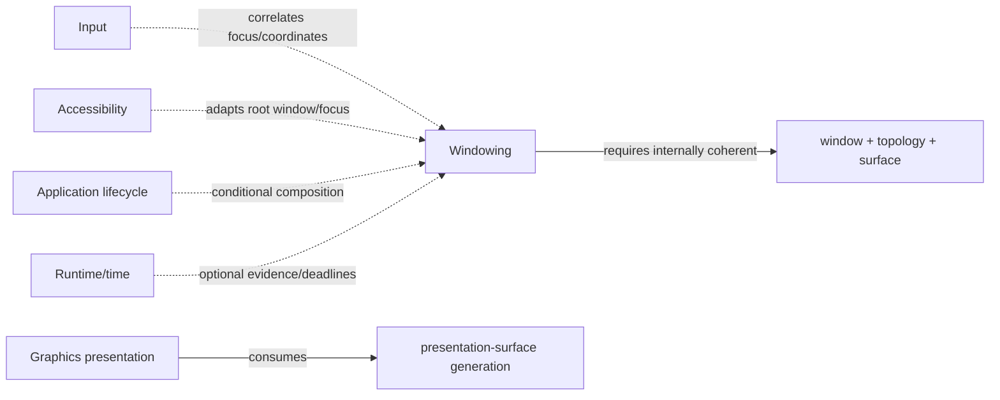

# Windowing dependency and profile composition

**Status:** Reviewed domain composition  
**Scope:** Windowing 0.1.1

The arrows distinguish ownership and consumption. Graphics consuming a surface does not make windowing depend on a graphics API; input and accessibility correlate with window observations without moving their semantics into windowing.

| Relationship | Type | Required boundary |
|---|---|---|
| Window, display topology, presentation surface | required internal set | compatible generations and one committed snapshot model |
| [Graphics](../graphics/README.md) | downstream consumer | graphics owns device/render/present mechanics; windowing owns surface generation and invalidation |
| [Input](../input/README.md) | peer correlation | focus and revision-bound coordinates correlate; windowing does not interpret input |
| [Accessibility](../accessibility/README.md) | peer adapter | native root-window/focus exposure composes with application-owned semantics |
| [Lifecycle](../lifecycle/README.md) | conditional | activation/session/termination policy may create, restore, hide, or destroy windows without redefining lifecycle |
| [Runtime/time](../runtime-time/README.md) | optional | deadlines/timestamps support evidence and bounded waits; wall time never orders window state |

The [windowed desktop profile](../profiles/foundation-windowed-desktop.md) requires all three windowing contracts `>=0.1.0,<0.2.0`. Headless/server profiles do not inherit them. Interactive terminal products remain incomplete until concrete windowing, graphics/text, and accessibility adapters are selected and evidenced.

**RM-WINDOWING-DEPENDENCY-0001:** A profile MUST select compatible window, display-topology, and presentation-surface generations and resolve every applicable peer/downstream interaction explicitly.

**RM-WINDOWING-DEPENDENCY-0002:** Consumer relationships MUST NOT invert ownership: graphics cannot destroy a window, input cannot define committed geometry, and accessibility adapters cannot become application semantic truth.

**RM-WINDOWING-DEPENDENCY-0003:** Domain composition MUST NOT be emitted as capability-graph edges until exact endpoint identities, direction, condition, and source semantics are reviewed.

