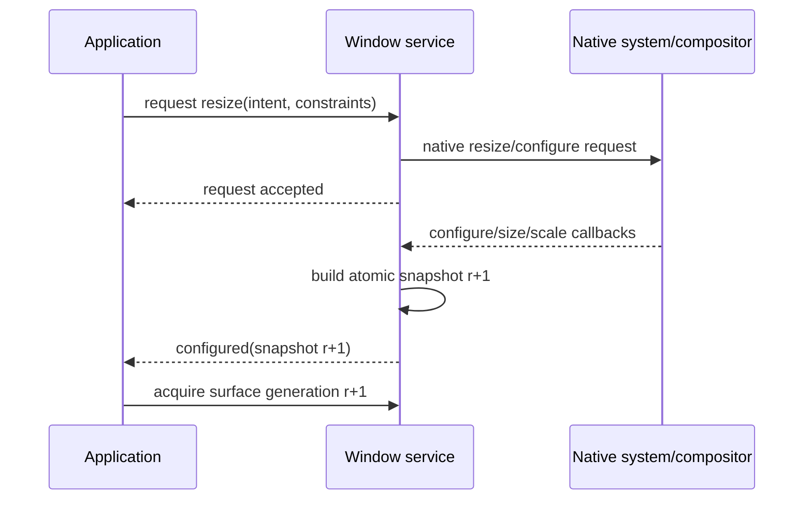

# Window event and concurrency model

## Event envelope

Every event carries window identity, per-window sequence, committed revision (or causal predecessor), monotonic observation time, provenance, and payload. Configuration-related events carry the complete snapshot rather than a bag of partially ordered property changes.

**RM-WINDOWING-EVENT-0001:** Events for one window are delivered in strictly increasing sequence order. Cross-window order is unspecified unless an event carries an explicit causal link.

**RM-WINDOWING-EVENT-0002:** Configuration changes may coalesce only when the final complete snapshot is preserved and the event declares the skipped revision interval. Close, destruction, focus loss, authority/security changes, and surface invalidation are not silently dropped.

**RM-WINDOWING-EVENT-0003:** Overflow never blocks the native dispatch thread indefinitely. A provider either applies specified coalescing or terminates delivery with a structured overflow diagnostic; it never silently loses non-coalescible events.

**RM-WINDOWING-EVENT-0004:** Event handlers are not invoked from native callbacks and are non-reentrant per consumer stream. Required immediate native replies are completed by backend policy using previously supplied constraints; deferred application policy receives a later event.

**RM-WINDOWING-EVENT-0005:** A snapshot read after observing event sequence `n` is at least the event's committed revision. Consumers can reconcile gaps by reading the latest snapshot.

**RM-WINDOWING-EVENT-0006:** Shutdown emits terminal delivery exactly once. No event follows `destroyed`; queued events referencing invalid surface generations are either delivered before destruction or superseded explicitly.

## Request/observation flow

