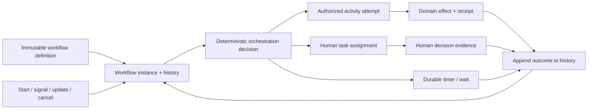

# Application workflow, durable orchestration, and human-task foundations

| Field | Value |
|---|---|
| Status | Draft domain analysis |
| Purpose | Coordinate long-running automated and human work through durable state and explicit effects without claiming distributed transactions or exactly-once external outcomes |

## Conclusions

- Workflow definition, instance, history, orchestration decision, activity attempt, human task, command, signal, timer, and domain effect are distinct entities.
- Durable replay reconstructs orchestration state from recorded inputs and outcomes; it does not repeat or authorize external effects.
- Activities are at-least-once attempts unless the exact target effect is transactionally deduplicated or fenced.
- Compensation is a newly authorized forward action over observed prior effects, not rollback or proof that the original effect disappeared.
- Human tasks are durable assignments with identity, authority, deadlines, evidence, accessibility, privacy, delegation, and conflict controls.

## Documents

- [Model and lifecycle](model.md)
- [Definitions, state machines, and validation](definitions.md)
- [History, replay, and determinism](history-replay.md)
- [Activities, commands, signals, and events](activities-events.md)
- [Retries, idempotency, fencing, and effects](retries-effects.md)
- [Timers, calendars, waits, and deadlines](timers-waits.md)
- [Parallelism, joins, races, and child workflows](parallel-child.md)
- [Cancellation, termination, and compensation](cancellation-compensation.md)
- [Definition evolution and in-flight migration](versioning-migration.md)
- [Human tasks, assignments, and forms](human-tasks.md)
- [Approvals, quorum, and separation of duties](approvals.md)
- [Operations, repair, and recovery](operations-recovery.md)
- [Platform and standards research](platform-research.md)
- [Cross-cutting qualities](cross-cutting.md)
- [Conformance](conformance.md)
- [Benchmarks](benchmarks.md)

## Decisions

- [ADR-0134: Workflow replay reconstructs decisions and never repeats effects implicitly](../../adr/0134-workflow-replay-reconstructs-decisions-not-effects.md)
- [ADR-0135: Compensation is a forward action, not rollback](../../adr/0135-compensation-is-a-forward-action-not-rollback.md)

## Boundary

This domain composes messaging, persistence, coordination, policy, authorization, scheduling, notifications, identity governance, and observability. It does not choose an orchestration engine, workflow language, domain process, activity implementation, form system, organizational approval policy, database transaction boundary, or service objective.
