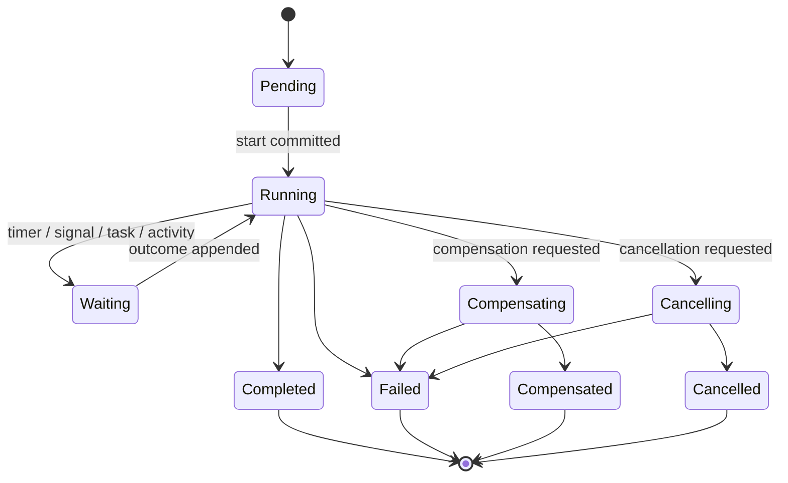

# Model and lifecycle

**RM-WORKFLOW-MODEL-0001:** Definition, instance, run, event history, command, signal, update, query, orchestration decision, activity, attempt, timer, child workflow, human task, assignment, decision, compensation, repair, and domain effect are distinct typed entities.

**RM-WORKFLOW-MODEL-0002:** An instance binds workflow/definition generation, tenant, business key, initiator/subject/actor, input schema/value generation, authority, start time, current run, history frontier, status, search projection, retention, and privacy classification.

**RM-WORKFLOW-MODEL-0003:** Lifecycle milestones distinguish request accepted, history committed, decision scheduled, activity dispatched, worker accepted, effect attempted, effect committed, result recorded, transition applied, projection visible, and workflow closed.

**RM-WORKFLOW-MODEL-0004:** Terminal status distinguishes completed, failed, cancelled, terminated, compensated, timed out, continued-as-new, superseded, quarantined, and indeterminate repair state with exact residual effects.

**RM-WORKFLOW-MODEL-0005:** Every external stimulus has stable identity, schema generation, causation/correlation, source, subject/actor, authority, event/effective/received times, deduplication policy, expiry, and acceptance outcome.

**RM-WORKFLOW-MODEL-0006:** Workflow state is reconstructed only from authenticated committed history plus selected immutable definition/runtime generations; mutable ambient configuration, current time, randomness, filesystem, network, or process identity cannot silently alter replay.
