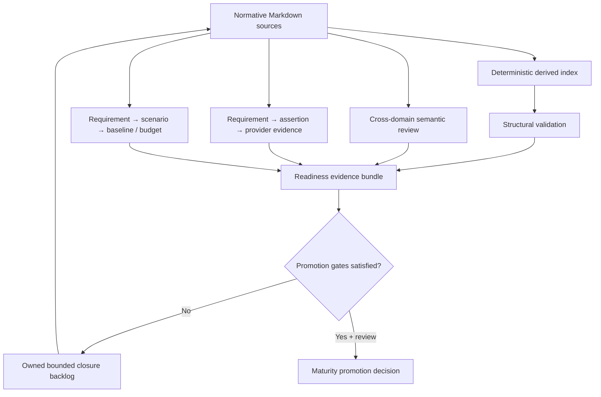

# Architecture consistency, traceability, and readiness

**Status:** Accepted foundation governance  
**Authority:** [Authoritative architecture model](../../01-architecture/architecture-model.md)

This model makes architecture maturity a reproducible evidence claim. It does not turn document count, generated indexes, or a passing link checker into implementation authority.

## Governing conclusions

- Markdown remains authoritative; machine-readable indexes are deterministic derived evidence ([ADR-0146](../../adr/0146-machine-readable-indexes-are-derived-evidence.md)).
- Readiness is a scoped evidence bundle, not a label inferred from document volume or structural cleanliness ([ADR-0147](../../adr/0147-readiness-is-an-evidence-bundle-not-a-label.md)).
- Structural, semantic, traceability, conformance, benchmark, security, accessibility, internationalization, operational, and governance readiness remain separately reportable.
- Unknown and not-yet-applicable are explicit states. Neither is silently converted into pass.
- A Draft capability may be architecture-definition ready while remaining ineligible for implementation release or Stable promotion.

## Documents and evidence

- [Consistency and readiness model](model.md)
- [Audit rules and finding lifecycle](audit-rules.md)
- [Maturity and promotion gates](maturity-promotion.md)
- [Domain promotion decision model](promotion-decisions.md)
- [Generated domain promotion scorecards](promotion-scorecards.md)
- [Domain readiness review schema](domain-readiness-schema.md) and [template](domain-readiness-template.md)
- [Benchmark scenario and run traceability](benchmark-traceability.md)
- [Normative-source freshness and cross-cutting coverage](source-freshness.md)
- [Generated cross-cutting quality matrix](quality-matrix.md)
- [Source-linked typed dependency graph](dependency-graph.md)
- [Canonical shared semantic vocabulary](vocabulary.md)
- [Cross-domain contradiction ledger](contradiction-ledger.md)
- [Foundation capability-batch integration review](foundation-batch-integration-review.md)
- [Bounded closure backlog](closure-backlog.md)
- [Generated audit report](audit-report.md)
- [Machine-readable inventory](index.json)

## Reproduce

Run `python tools/akb_audit.py` to refresh derived evidence and `python tools/akb_audit.py --check` to verify that committed evidence matches the Markdown sources. The tool has no third-party dependencies and never edits normative documents.
