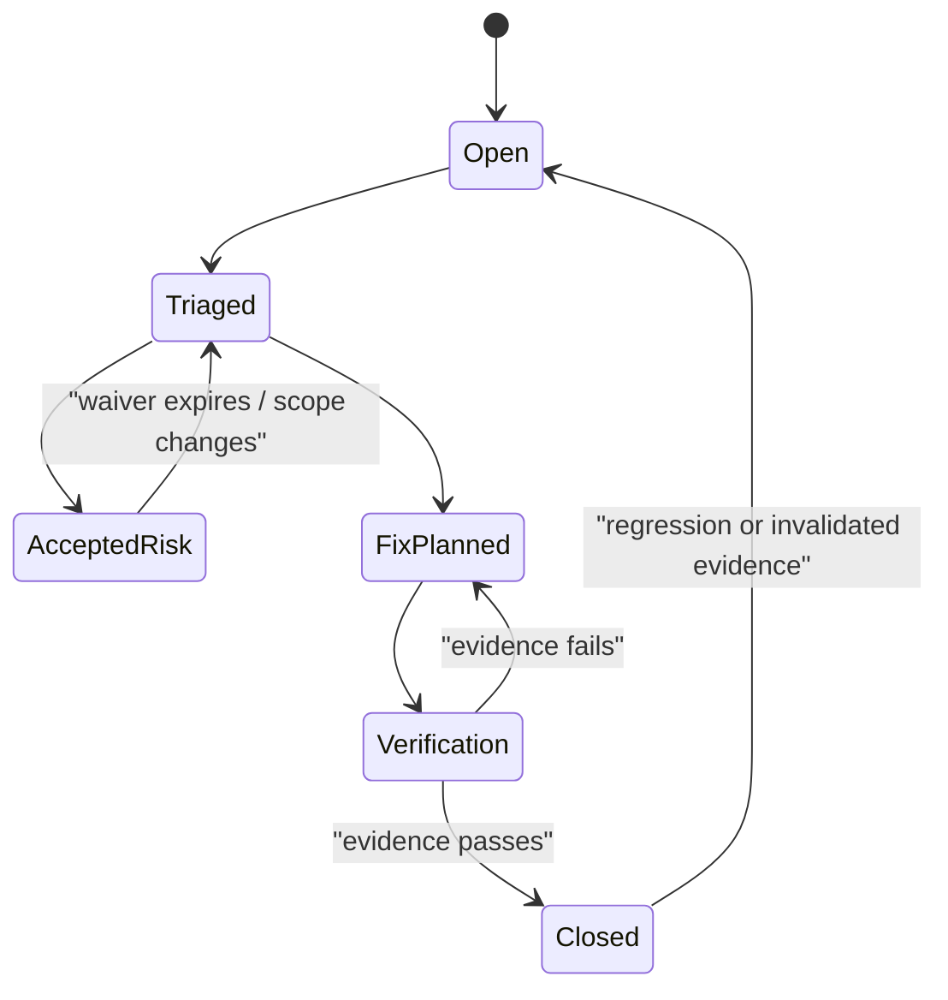

# Audit rules and finding lifecycle

## Automated structural rules

The deterministic audit checks:

- unique normative requirement identifiers and source lines;
- resolvable internal document links;
- balanced fenced blocks;
- one indexed record for every ADR file and no index entry without a file;
- one README, conformance specification, and benchmark specification per capability domain;
- canonical table-form domain status when available;
- freshness of the committed machine-readable index and generated report.

**RM-READINESS-AUDIT-0001:** Automated checks MUST be deterministic, dependency-minimal, and fail closed on malformed input or stale generated evidence.

**RM-READINESS-AUDIT-0002:** A structural pass MUST state its nonclaims and MUST NOT be presented as semantic, conformance, performance, or release readiness.

## Human-governed semantic rules

Reviewers examine:

1. authority inversions, circular definitions, and duplicated normative ownership;
2. shared entity identity, generation, lifecycle, and state terminology;
3. distinctions between intent, acceptance, effect, observation, evidence, and authority;
4. time, ordering, cancellation, retry, idempotency, correction, and recovery semantics;
5. dependency direction, optionality, conflicts, and profile satisfiability;
6. security, privacy, accessibility, i18n, observability, performance, and operational composition;
7. contradictory platform claims or hidden lowest-common-denominator behavior;
8. requirements without verification methods and assertions without requirements.

**RM-READINESS-AUDIT-0003:** Every semantic finding MUST identify exact sources, conflicting propositions, affected subjects, severity, owner, disposition, and verification needed for closure.

**RM-READINESS-AUDIT-0004:** Absence of a detected contradiction is not proof of consistency; a review claim MUST state reviewed scope, rules, reviewers, and evidence frontier.

## Finding lifecycle

Severity measures architectural consequence, not editing effort. Critical findings invalidate affected authority or safety claims; high findings block the claimed readiness scope; medium findings require owned closure or explicit policy disposition; low findings improve clarity or automation without changing current meaning.
