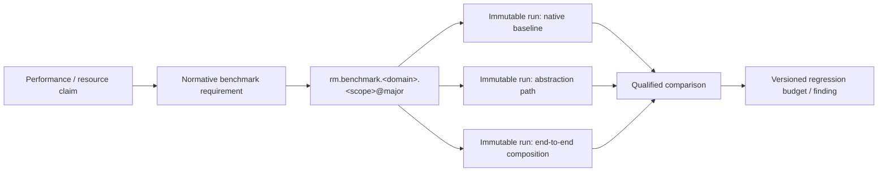

# Benchmark scenario and run traceability

**Status:** Accepted foundation governance  
**Authority:** [Verification architecture](../verification.md)

Benchmark semantics need identity before an implementation exists, but measured runs must remain immutable observations. A scenario names a comparable experiment contract; a run names one execution under an exact environment ([ADR-0151](../../adr/0151-benchmark-scenarios-and-runs-have-distinct-identities.md)).

## Identity and evolution

- Scenario identity includes workload semantics, measured boundary, required guarantees, parameter dimensions, metrics/statistics, baseline equivalence, and correctness gates.
- Compatible additions such as another payload size or reported metric retain the scenario major.
- Changed effect boundary, durability/security semantics, primary workload, correctness oracle, or comparison population requires a new major.
- A run identifier binds scenario version, source/artifact digests, provider/platform/hardware, configuration, dataset/seed, clocks, warmup, repetitions, raw samples, statistics, and provenance.

**RM-READINESS-BENCH-0001:** Every normative benchmark requirement MUST map to at least one stable semantic scenario before Experimental promotion.

**RM-READINESS-BENCH-0002:** A scenario MUST define semantic equivalence and correctness gates before comparing native, abstraction, or end-to-end paths; a faster semantically weaker path is not a valid baseline win.

**RM-READINESS-BENCH-0003:** Each run MUST be immutable and reproducible from bound artifacts and environment evidence; reruns create new identities rather than overwriting samples.

**RM-READINESS-BENCH-0004:** Results MUST publish distributions, uncertainty, exclusions, noise/environment metadata, and raw or losslessly recoverable samples. A single aggregate is insufficient for a release claim.

**RM-READINESS-BENCH-0005:** Regression budgets are versioned policy over comparable runs. Budget changes cannot rewrite prior pass/fail conclusions and require rationale, owner, and affected-release analysis.

## Current migration frontier

- Messaging/RPC, application synchronization, and audit evidence have direct benchmark-requirement-to-scenario maps.
- Runtime/time and windowing already have stable suite-local benchmark IDs but predate normative benchmark requirement IDs; those IDs remain reserved while semantic scenario aliases and exact requirement links are reviewed.
- Other domains have benchmark specifications but do not yet have direct scenario mappings.
- No domain has implementation run evidence; this is expected while specifications remain Draft and implementation gates are closed.
