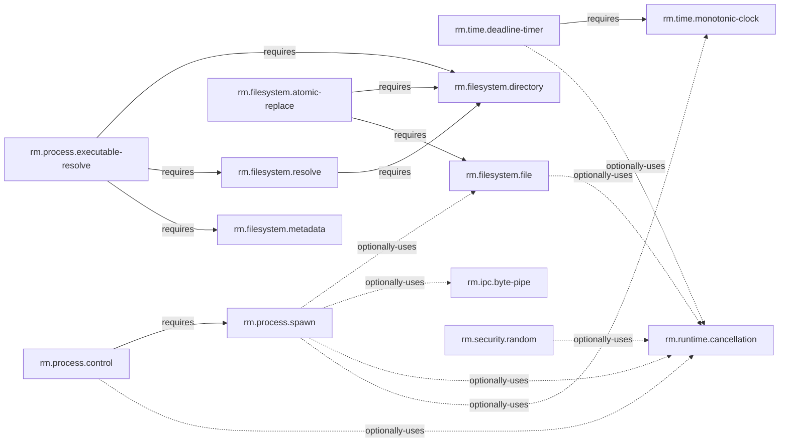

# Source-linked capability dependency graph

**Status:** Accepted partial graph  
**Authority:** [Capability graph model](../../02-capabilities/graph-model.md)

This graph records only dependencies explicitly stated by capability specifications. It is partial by design: missing edges mean “not yet declared,” not “independent.” Composition diagrams, data flow, profile membership, shared terminology, and directory links do not create dependency edges ([ADR-0148](../../adr/0148-dependency-edges-require-source-declaration.md)).

## Declared nodes

| Capability | Normative candidate specification | Maturity |
|---|---|---|
| `rm.time.monotonic-clock` | [Monotonic clock](../../02-capabilities/runtime-time/monotonic-clock.md) | Draft |
| `rm.time.deadline-timer` | [Deadline timer](../../02-capabilities/runtime-time/deadline-timer.md) | Draft |
| `rm.runtime.cancellation` | [Cancellation](../../02-capabilities/runtime-time/cancellation.md) | Draft |
| `rm.filesystem.directory` | [Directory](../../02-capabilities/filesystem/directory.md) | Draft |
| `rm.filesystem.resolve` | [Resolution](../../02-capabilities/filesystem/resolve.md) | Draft |
| `rm.filesystem.file` | [File I/O](../../02-capabilities/filesystem/file.md) | Draft |
| `rm.filesystem.metadata` | [Metadata](../../02-capabilities/filesystem/metadata.md) | Draft |
| `rm.filesystem.atomic-replace` | [Atomic replacement](../../02-capabilities/filesystem/atomic-replace.md) | Draft |
| `rm.security.random` | [Secure randomness](../../02-capabilities/security/random.md) | Draft |
| `rm.security.attenuate` | [Authority attenuation](../../02-capabilities/security/attenuation.md) | Draft |
| `rm.security.secret-store` | [Secret store](../../02-capabilities/security/secret-store.md) | Draft |
| `rm.process.executable-resolve` | [Executable resolution](../../02-capabilities/process/executable-resolve.md) | Draft |
| `rm.process.spawn` | [Process spawn](../../02-capabilities/process/spawn.md) | Draft |
| `rm.process.control` | [Process control](../../02-capabilities/process/control.md) | Draft |
| `rm.ipc.byte-pipe` | [Byte pipe](../../02-capabilities/ipc/byte-pipe.md) | Draft |

## Declared edges

| Source | Type | Target | Evidence source | Rationale |
|---|---|---|---|---|
| `rm.time.deadline-timer` | `requires` | `rm.time.monotonic-clock` | [Runtime/time domain](../../02-capabilities/runtime-time/README.md) | Deadline semantics require a compatible monotonic time domain. |
| `rm.time.deadline-timer` | `optionally-uses` | `rm.runtime.cancellation` | [Runtime/time domain](../../02-capabilities/runtime-time/README.md) | Timers may observe cancellation without strengthening their minimum contract. |
| `rm.filesystem.resolve` | `requires` | `rm.filesystem.directory` | [Resolution contract](../../02-capabilities/filesystem/resolve.md) | Resolution consumes an explicit directory resource as its authority and namespace root. |
| `rm.filesystem.file` | `optionally-uses` | `rm.runtime.cancellation` | [Filesystem domain](../../02-capabilities/filesystem/README.md) | File operations may observe portable cancellation. |
| `rm.filesystem.atomic-replace` | `requires` | `rm.filesystem.directory` | [Atomic replacement contract](../../02-capabilities/filesystem/atomic-replace.md) | Source and destination namespace authority are directory resources. |
| `rm.filesystem.atomic-replace` | `requires` | `rm.filesystem.file` | [Atomic replacement contract](../../02-capabilities/filesystem/atomic-replace.md) | Replacement consumes a prepared regular-file resource and its synchronization semantics. |
| `rm.process.executable-resolve` | `requires` | `rm.filesystem.directory` | [Executable resolution contract](../../02-capabilities/process/executable-resolve.md) | Search roots are explicit ordered directory authorities. |
| `rm.process.executable-resolve` | `requires` | `rm.filesystem.resolve` | [Executable resolution contract](../../02-capabilities/process/executable-resolve.md) | Candidate lookup uses the filesystem traversal policy and reports its R-level. |
| `rm.process.executable-resolve` | `requires` | `rm.filesystem.metadata` | [Executable resolution contract](../../02-capabilities/process/executable-resolve.md) | Candidate eligibility and identity evidence use explicit metadata semantics. |
| `rm.process.spawn` | `optionally-uses` | `rm.filesystem.file` | [Process domain](../../02-capabilities/process/README.md) | Authorized file resources may bind standard I/O or inheritance. |
| `rm.process.spawn` | `optionally-uses` | `rm.ipc.byte-pipe` | [Process domain](../../02-capabilities/process/README.md) | Pipe endpoints may bind standard I/O. |
| `rm.process.spawn` | `optionally-uses` | `rm.runtime.cancellation` | [Process domain](../../02-capabilities/process/README.md) | Startup and wait paths may observe cancellation. |
| `rm.process.spawn` | `optionally-uses` | `rm.time.monotonic-clock` | [Process domain](../../02-capabilities/process/README.md) | Evidence may use monotonic timestamps. |
| `rm.process.control` | `requires` | `rm.process.spawn` | [Process control contract](../../02-capabilities/process/control.md) | Control consumes spawn's owned-child resource and never treats a PID as authority. |
| `rm.process.control` | `optionally-uses` | `rm.runtime.cancellation` | [Process control contract](../../02-capabilities/process/control.md) | Cancellation may stop waiting for dispatch confirmation but cannot retract a delivered request. |
| `rm.security.random` | `optionally-uses` | `rm.runtime.cancellation` | [Security domain](../../02-capabilities/security/README.md) | A provider readiness wait may observe cancellation. |

## Validation and coverage

**RM-READINESS-GRAPH-0001:** Every graph node MUST link to its declaring specification and every edge MUST link to a source that explicitly states the relationship.

**RM-READINESS-GRAPH-0002:** The `requires` subgraph MUST be acyclic; endpoints MUST be declared nodes; duplicate node identities and duplicate incompatible edges MUST fail validation.

**RM-READINESS-GRAPH-0003:** Optional use MUST NOT silently strengthen the source capability's minimum guarantees. Conflict edges MUST state condition and conflict class before inclusion.

**RM-READINESS-GRAPH-0004:** Graph coverage MUST report declared, referenced-but-undeclared, and unknown relationships separately. Absence from this partial graph is not proof of independence.

## Deliberate gaps

- Service and profile composition remain separate views, not capability edges.
- The 62 domain analyses do not yet all expose stable capability-node registries.
- Cross-domain references in recent application-platform analyses require owner review before conversion into `requires` or `optionally-uses` edges.
- No `conflicts-with` edge is currently source-declared strongly enough for this registry.
