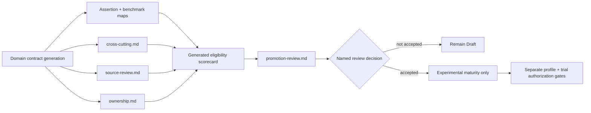

# Domain readiness review schema

**Status:** Accepted foundation governance  
**Authority:** [Architecture consistency and readiness model](README.md)  
**Decision:** [ADR-0159](../../adr/0159-domain-readiness-reviews-use-schema-validated-markdown.md)

The schema makes reviewed evidence consistent without replacing Markdown authority or selecting a general metadata serialization. It was derived from two materially different pilots: native runtime/time primitives and distributed application synchronization.

## Canonical artifacts

| Artifact | Required purpose | Pass metadata/content |
|---|---|---|
| `README.md` | domain authority and maturity | table-form `Status`; exact generation and accountable role for reviewed candidates |
| `traceability.md` | requirement-to-assertion and benchmark-scenario maps | every domain capability and benchmark requirement mapped |
| `cross-cutting.md` | six-dimension applicability and evidence review | `Review status`, date, frontier, owner, blocking findings; security/privacy, performance, accessibility, internationalization, observability, operations rows |
| `source-review.md` | authority, currency, applicability, and impact | review date, expiry/trigger, reviewer, findings, source identity/link, class/status, proposition, impact |
| `ownership.md` | accountable maintenance and bounded trial planning | accountable/architecture/security/evidence roles, duties, bounded plan, stop and disposal conditions |
| `promotion-review.md` | exact candidate decision record | status, subject, architecture, proposed decision, implementation authority, gate assessment, decision boundary, named disposition when accepted |

Start new work from the [domain readiness template](domain-readiness-template.md). A domain may split detail into linked files, but these conventional entry points remain stable for validation and discovery.

## Gate semantics

- `pass` means the exact reviewed artifact satisfies this schema and states no blocking finding.
- `fail` means evidence contradicts the gate, has expired, or declares a blocker.
- `unknown` means the artifact or required proof is absent, malformed, indirect, or unreviewed.
- `not-applicable` and `waived` require the ordinary reviewed records; the current generated eligibility projection does not infer them.

**RM-READINESS-REVIEW-0001:** A passing domain review MUST use the canonical artifacts and fields or an accepted schema version that preserves equivalent validation and meaning.

**RM-READINESS-REVIEW-0002:** Review dates MUST use ISO `YYYY-MM-DD`; source reviews MUST bind an expiry date or material-change trigger, and expired evidence MUST fail the affected gate.

**RM-READINESS-REVIEW-0003:** Cross-cutting review MUST address security/privacy, performance, accessibility, internationalization, observability, and operations with exact requirements, evidence method, owner, finding, or justified non-applicability.

**RM-READINESS-REVIEW-0004:** Source review MUST link exact source identities, state authority/stability class and reviewed status/version, bind affected propositions, and record impact/limitations.

**RM-READINESS-REVIEW-0005:** Ownership review MUST define duties, bounded trial scope/nonclaims, stop conditions, cleanup/disposal, and roles; an accepted promotion or trial MUST replace role-only placeholders with accountable people.

**RM-READINESS-REVIEW-0006:** A generated eligibility result MUST remain non-authoritative and MUST NOT edit domain maturity, accept a promotion record, create a repository profile, or authorize a trial.

**RM-READINESS-REVIEW-0007:** A Proposed promotion review MUST preserve Draft status and `Implementation authority: None`; an Accepted record requires separately validated named decision fields and cannot imply trial authority.

**RM-READINESS-REVIEW-0008:** Review-schema validation MUST fail closed on missing fields, malformed dates, expiry, missing dimensions/sections, contradictory status, stale derived evidence, or unresolved internal links.

