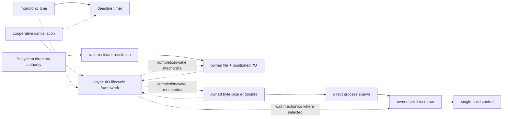

# Foundation capability-batch integration review

| Field | Value |
|---|---|
| Review status | Pass with explicit nonclaims |
| Reviewed | 2026-08-08 |
| Scope | Runtime/time 0.2.0; filesystem, process, IPC, and async I/O 0.1.1; architecture model 1.88.0 |
| Accountable owner | Foundation architecture review |
| Open blocking findings | None for architecture-definition compatibility; named promotion, standards-profile, trial, provider, and implementation evidence remain absent |

## System view

Solid arrows depict stable capability/resource semantics; dotted arrows depict optional use or provider-framework integration. The visual is not a substitute for the source-linked graph.

## Compatibility matrix

| Concern | Runtime/time rule | Filesystem/process/IPC rule | Async I/O rule | Verdict |
|---|---|---|---|---|
| Identity and authority | cancellation tokens and clock domains are typed resources | directory/file/pipe/child objects carry scoped authority; paths/PIDs are observations | operation/registration generations prevent reuse but confer no domain authority | Consistent |
| Cancellation | request is idempotent, cooperative, and races completion | confirmed canceled requires terminal domain outcome; partial effects remain visible | request, acknowledgement, terminal result, and reclamation are distinct | Consistent; ADR-0053 governs lifetime |
| Progress and milestones | timer expiry/request/disarm are distinct | partial bytes, creation/image/readiness, dispatch/exit/reap, EOF/broken-peer are typed separately | readiness/dequeue/wake are internal stages, never domain success | Consistent; no milestone collapse |
| Ownership and cleanup | dropping sources does not silently cancel; shutdown is explicit | drop/close/detach/terminate and endpoint/reference rules are declared | future drop is cancel-or-detach policy; state survives to terminal acknowledgement | Consistent |
| Sync completeness | direct sync wait; no hidden runtime | sync file/pipe/spawn/wait paths are genuine and explicit | framework cannot require global executor or nest/pump an event loop | Consistent |
| Backpressure/fairness | fanout and shutdown work are bounded | pipe capacity, process resources, pipeline captures are bounded | queues, batches, retries, workers, wakes, and telemetry are bounded; fairness is scoped | Consistent |
| Ordering/time | monotonic time supports intervals/deadlines, not universal causality | positioned I/O, process milestones, pipe bytes have domain-specific ordering | submission, native completion, dequeue, wake, and poll order are not equivalent | Consistent |
| Provider variance | provider epochs/clock quality disclosed | filesystem family, parser, P-level, pipe Q-level are explicit | mechanism support is per operation/resource/version | Consistent |
| Dependency semantics | stable nodes/edges require exact declarations | capability edges separated from resources, services, subjects, and profiles | framework integration does not create a universal graph node | Resolved by ADR-0160 |
| Evidence boundary | timestamps and cancellation observations are evidence, not effects | conformance/benchmarks retain domain-specific oracles | framework tests establish lifecycle invariants, not domain effect correctness | Consistent |

## Finding disposition

| ID | Finding | Disposition | Evidence |
|---|---|---|---|
| FB-001 | Shared async lifecycle could be mistaken for an independently selectable capability and universal operation API. | Resolved | [ADR-0160](../../adr/0160-async-io-lifecycle-is-a-provider-framework-not-a-universal-capability.md), [async composition](../../02-capabilities/async-io/dependencies.md) |
| FB-002 | Cancellation vocabulary could confuse token request with provider acknowledgement or domain terminal cancellation. | Consistent | [cancellation](../../02-capabilities/runtime-time/cancellation.md), [ADR-0053](../../adr/0053-cancellation-does-not-end-operation-lifetime.md), [async lifetime](../../02-capabilities/async-io/cancellation-lifetime.md) |
| FB-003 | Process/pipe/file operations could inherit hidden runtime assumptions from async-first policy. | Consistent | [architecture execution model](../../01-architecture/architecture-model.md#9-execution-and-concurrency-model), [filesystem file](../../02-capabilities/filesystem/file.md), [byte pipe](../../02-capabilities/ipc/byte-pipe.md), [process spawn](../../02-capabilities/process/spawn.md) |
| FB-004 | Resource transfer and data flow could be misread as capability dependencies. | Consistent | [dependency graph](dependency-graph.md), [process composition](../../02-capabilities/process/dependencies.md), [IPC composition](../../02-capabilities/ipc/dependencies.md) |
| FB-005 | Cross-domain benchmark comparison could mix readiness, completion, blocking, durability, containment, or Q-level guarantees. | Consistent with execution gap | domain traceability maps and [benchmark governance](benchmark-traceability.md) require guarantee-equivalent scenarios; no measured run exists |

## Integration gates

**RM-FOUNDATION-BATCH-0001:** A provider integration MUST bind exact compatible contract generations for every selected domain capability and framework invariant.

**RM-FOUNDATION-BATCH-0002:** Resource authority, operation identity, cancellation state, native acknowledgement, terminal domain outcome, and evidence identity MUST remain distinct types and lifecycle facts.

**RM-FOUNDATION-BATCH-0003:** Cross-domain conformance MUST combine lifecycle model tests with domain-specific effect oracles; neither evidence class can substitute for the other.

**RM-FOUNDATION-BATCH-0004:** Cross-domain benchmarks MUST compare equivalent semantics and quality levels, including R/D/P/Q levels, parser/milestone policy, cancellation, backpressure, and shutdown scope where applicable.

**RM-FOUNDATION-BATCH-0005:** This Pass establishes architecture-definition compatibility only. It MUST NOT change domain maturity, authorize implementation/trials, select repositories/crates/runtimes/providers, or imply portability/native-performance evidence.

## Conclusion

The batch is internally compatible at its documented architecture frontier. Seven domain scorecards may be planning-eligible, but every domain remains Draft and every implementation gate remains closed. The next safe action is continued specification closure or named governance review—not code.
