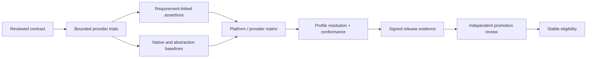

# Maturity and promotion gates

## Draft to Experimental

A capability is eligible for an implementation trial only when:

- purpose, scope, non-goals, entities, states, operations, errors, and authority are reviewed;
- dependencies and profile impact are explicit;
- supported-platform research identifies native mechanisms and semantic gaps;
- security, performance, accessibility, i18n, observability, and operations have planned evidence;
- conformance assertions and benchmark scenarios can falsify material claims;
- the spike is disposable, bounded, and prohibited from silently establishing stable API precedent.

## Experimental to Stable

Stable eligibility additionally requires:

- accepted ADR/RFC authority and a named owner;
- direct requirement-to-assertion mapping with passing provider evidence for every supported target;
- profile resolution and profile conformance for every claimed workload;
- native baseline and abstraction benchmark results inside approved budgets;
- compatibility, versioning, migration, deprecation, and support policy;
- threat, privacy, accessibility, i18n, observability, recovery, and supply-chain reviews;
- unresolved exceptions represented in immutable release evidence;
- an independent promotion review.

**RM-READINESS-PROMOTION-0001:** File presence, document volume, an implementation demo, or a single provider result MUST NOT independently satisfy a maturity gate.

**RM-READINESS-PROMOTION-0002:** Promotion evidence MUST cover every claimed platform/profile or narrow the claim before promotion.

**RM-READINESS-PROMOTION-0003:** A waiver MUST name the blocked gate, affected claim, owner, rationale, compensating evidence, expiry, and closure condition; it MUST NOT waive an undeclared safety invariant.

**RM-READINESS-PROMOTION-0004:** Stable promotion MUST be an explicit reviewed decision. It cannot occur as a side effect of merging implementation code or publishing an artifact.
