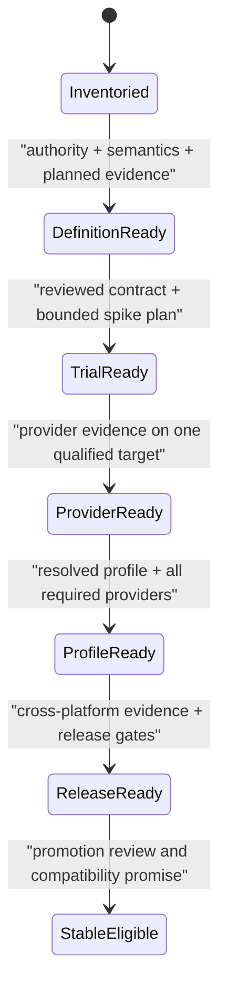

# Consistency and readiness evidence model

## Evidence dimensions

| Dimension | Question | Minimum evidence | Nonclaim |
|---|---|---|---|
| Authority | Is each rule owned by the right source? | authority link and conflict rule | link presence proves correctness |
| Structure | Can every source and identifier be resolved? | link, fence, identifier, index checks | semantics are coherent |
| Vocabulary | Do shared terms preserve one meaning? | canonical term plus reviewed mappings | identical words imply identical entities |
| Dependency | Are required edges typed, acyclic, and satisfiable? | graph record and resolution evidence | directory proximity is dependency |
| Traceability | Can a promise reach an assertion and result? | stable bidirectional identifiers | a conformance file covers every promise |
| Conformance | Does observed behavior satisfy the contract? | scenario, oracle, environment, result | one provider proves portability |
| Performance | Is overhead measured against a comparable native baseline? | workload, baseline, environment, statistics, budget | fastest result satisfies semantics |
| Cross-cutting | Are security, privacy, accessibility, i18n, observability, and operations composed? | dimension-specific review and exceptions | a generic checklist replaces domain analysis |
| Governance | Are ownership, exceptions, evolution, and promotion explicit? | accountable owner, decision, expiry, review | document status self-authorizes promotion |

## Readiness scopes

These are evidence scopes, not replacements for the Draft/Experimental/Stable lifecycle. A record reports both its lifecycle maturity and the highest readiness scope whose gates pass.

## Claim record

Every readiness claim binds:

- claim identifier, subject, lifecycle maturity, and claimed readiness scope;
- exact source and decision generations;
- applicable platform, architecture, provider, profile, and configuration set;
- structural and semantic audit results;
- requirement, assertion, benchmark, security, and cross-cutting evidence frontiers;
- open findings, waivers, owners, expiries, and incompatible evidence;
- reviewer identity, decision, time basis, and superseding claim.

**RM-READINESS-MODEL-0001:** A readiness claim MUST bind an exact subject and evidence frontier; it cannot describe the repository, a domain, and a release interchangeably.

**RM-READINESS-MODEL-0002:** Each dimension MUST report `pass`, `fail`, `unknown`, or `not-applicable` with rationale and evidence. Aggregation MUST NOT convert `unknown` into `pass`.

**RM-READINESS-MODEL-0003:** The aggregate readiness scope MUST NOT exceed the lowest required dimension after applying only explicit, time-bounded waivers allowed by policy.

**RM-READINESS-MODEL-0004:** Superseding evidence MUST preserve prior claims and explain changed sources, environments, findings, and conclusions.
