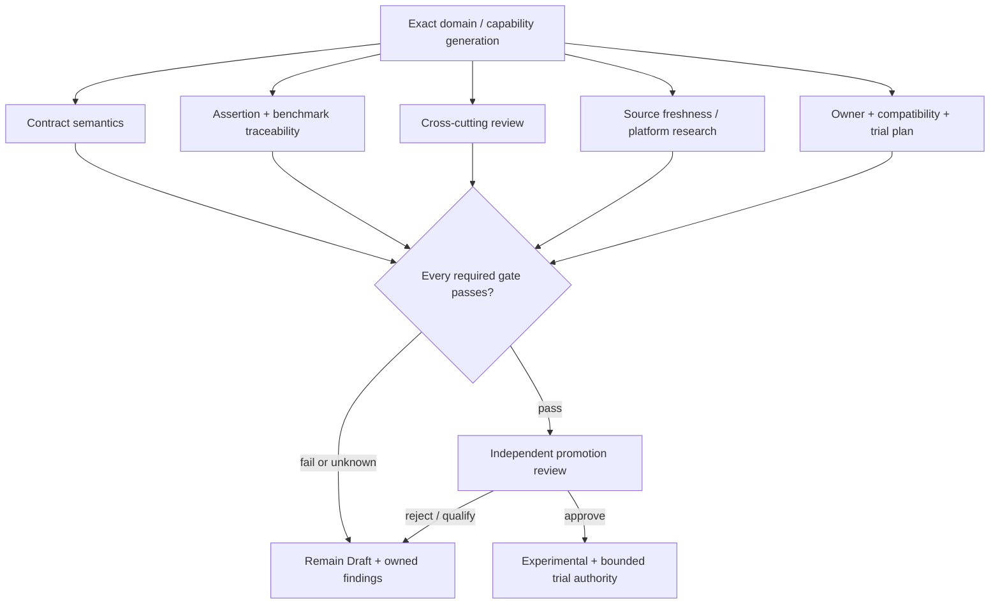

# Domain promotion decision model

**Status:** Accepted foundation governance  
**Authority:** [Maturity and promotion gates](maturity-promotion.md)

Promotion is a reviewed decision over conjunctive evidence gates, not a weighted score ([ADR-0154](../../adr/0154-maturity-promotion-uses-conjunctive-gates-not-scores.md)). The generated [domain scorecards](promotion-scorecards.md) show evidence state but cannot change maturity.

## Gate states

- `pass`: exact current evidence satisfies the gate.
- `fail`: evidence contradicts the gate or a blocking finding is open.
- `unknown`: evidence is missing, stale, indirect, or unreviewed; it blocks promotion.
- `not-applicable`: reviewed rationale proves the gate does not apply to the exact subject; it is not a synonym for missing.
- `waived`: policy explicitly permits a time-bounded exception with owner, compensating evidence, expiry, and closure condition.

**RM-READINESS-SCORECARD-0001:** Promotion gates MUST combine conjunctively unless an accepted policy explicitly marks a gate optional for the exact subject.

**RM-READINESS-SCORECARD-0002:** Numeric percentages, document counts, weighted scores, or averages MUST NOT compensate for a failed or unknown required gate.

**RM-READINESS-SCORECARD-0003:** Generated scorecards MUST link to exact evidence, preserve unknowns, disclose their inference rules, and remain non-authoritative decision support.

**RM-READINESS-SCORECARD-0004:** Promotion requires an explicit reviewed record binding subject/generation, gate results, findings/waivers, reviewers, decision, date, and trial constraints.

**RM-READINESS-SCORECARD-0005:** Experimental status authorizes only bounded learning within the accepted trial plan; it does not establish Stable API precedent, production support, portability, or release eligibility.

## Current conclusion

All domains remain Draft. Every domain has a contract inventory plus conformance and benchmark planning. Five have complete planned assertion mappings and three also have exact benchmark-scenario mappings. Cross-cutting review, source freshness, ownership, and trial-plan evidence are not yet complete domain by domain, so no Experimental promotion is authorized.
