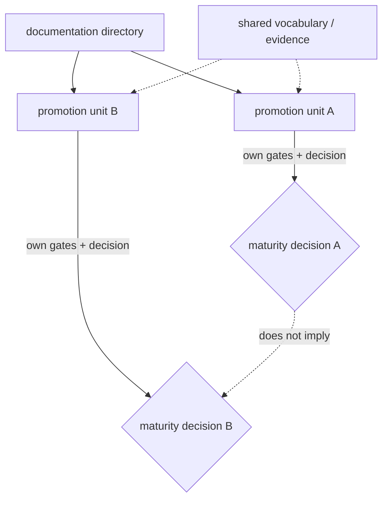

# Governed promotion-unit model

**Status:** Accepted governance model  
**Authority:** [ADR-0163](../../adr/0163-maturity-promotion-units-follow-evidence-boundaries-not-directory-layout.md)

A promotion unit is the smallest governed subject that can receive a coherent maturity decision. A directory is a documentation and navigation container. They often coincide, but neither implies the other.

## Unit criteria

A distinct unit is warranted when a subject has materially separable:

- accountable ownership or required specialist review;
- contract and compatibility surface;
- provider/platform or standards evidence;
- conformance and benchmark suite;
- threat, operational, or release risk;
- versioning/deprecation cadence;
- implementation-trial scope and rollback boundary.

Splitting solely to improve readiness percentages is prohibited. Combining subjects solely because files are co-located is equally prohibited.

## Registry contract

Composite directories publish `promotion-units.md`. Each machine-indexed row has this exact shape:

| Unit | Maturity | Accountable role | Primary specification | Readiness dossier | Boundary summary |
|---|---|---|---|---|---|
| `rm.promotion.example.unit` | Draft | Example owner | [Primary](README.md) | [Dossier](README.md) | Concise governed scope |

The primary specification and any linked readiness dossier must exist. Use an em dash when no complete unit dossier exists. Unit identifiers are repository-unique. A linked dossier uses canonical table fields: `Status` is `Proposed unit dossier; no maturity change`, `Subject` exactly matches the registry unit, `Architecture` names its model frontier, and `Implementation authority` is `None`. Dossier presence or schema validity means only that the evidence bundle is addressable; it does not establish semantic completeness, eligibility, maturity, implementation authority, or release authority. Maturity remains governed by explicit decision records; editing a registry row without the required accepted decision is invalid governance even if structurally parseable.

## Evidence and aggregation

Each unit owns requirements, assertions, cases, benchmark scenarios/runs, source and cross-cutting reviews, accountable roles, profiles, findings/waivers, and promotion decisions. Shared evidence must name every proposition and unit it supports; passing one unit cannot fill an unknown in another.

Directory-level reports aggregate unit state conjunctively and expose partial completion. They cannot silently report the strongest child state, average maturity, or percentage as domain maturity.

**RM-READINESS-UNIT-0001:** Promotion-unit boundaries MUST follow evidence/ownership/compatibility/release boundaries and MUST NOT be chosen to manipulate readiness metrics.

**RM-READINESS-UNIT-0002:** Every unit MUST have a stable unique identity, primary normative specification, accountable role, exact scope, maturity, evidence bundle, and explicit promotion decision history.

**RM-READINESS-UNIT-0003:** Shared evidence MUST remain proposition-scoped; one unit's maturity, waiver, provider result, or release claim MUST NOT transfer implicitly to another.

**RM-READINESS-UNIT-0004:** Directory reorganization is optional and separately governed. Partitioning maturity units MUST NOT require premature file moves, crate boundaries, repositories, packages, or implementation topology.

**RM-READINESS-UNIT-0005:** Generated indexes validate registry identity, primary-source integrity, and optional dossier existence/schema/subject/nonauthorization integrity but MUST NOT infer semantic dossier completeness, change maturity, or authorize implementation.
