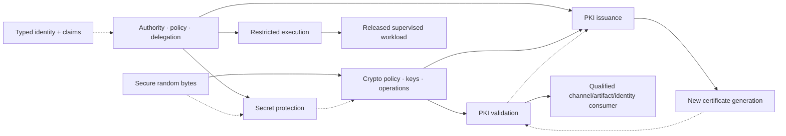

# Security-foundation promotion-unit batch integration review

| Field | Value |
|---|---|
| Review status | Pass with explicit nonclaims |
| Reviewed | 2026-08-08 |
| Scope | Seven Draft security promotion units and architecture model 1.98.0 |
| Accountable owner | Foundation architecture review |
| Open blocking findings | None for architecture-definition compatibility; unit promotion, batch trial authorization, provider selection, implementation, and release evidence remain absent |

## System view

Solid arrows are required semantic/evidence compositions for the depicted path. Dotted arrows are conditional inputs or lifecycle feedback. None automatically creates a capability-graph edge, crate dependency, shared provider, common maturity, or release bundle.

## Compatibility matrix

| Concern | Cross-unit invariant | Verdict |
|---|---|---|
| Identity and authority | identity, account, claim, membership, entitlement, key possession, certificate, attestation, trust result, and audit event are evidence; explicit resource authority and the protected operation remain separate | Consistent; ADR-0009 and ADR-0010 govern |
| Selection before side effects | authority policy, restricted manifest, secret protection vector, cryptographic plan, validation context, and issuance plan bind exact generations before protected provider activation or mutation | Consistent; any unknown or mismatch fails before the affected side effect |
| Randomness consumption | random supplies exact-fill secret-quality bytes only; consumers own purpose, structure, collision/replay rules, derivation, retention, zeroization, and proof | Consistent; output tests do not certify the source or consumer |
| Secret/key boundary | secret references and key handles may be opaque; non-reveal requires a named provider-mediated operation and shared provider identity does not imply compatible storage, key, operation, backup, export, or deletion semantics | Consistent; ADR-0012 and ADR-0133 govern |
| Crypto/PKI boundary | primitive signature/algorithm validity is not certificate syntax, path construction, trust, identity, status, POP, issuance authority, installation, activation, or application authorization | Consistent; ADR-0081–0083 and ADR-0090 govern |
| Validation/issuance cycle | validation consumes immutable certificate/status/trust evidence; issuance creates a new credential generation and may validate its result, but neither unit inherits the other’s authority, maturity, waiver, or provider result | Consistent; cycle is lifecycle feedback, not a required dependency loop |
| Restricted execution | authority is resolved and controls verified before release; the service cannot mint missing authority or infer isolation from identity, cryptography, certificate trust, or provider branding | Consistent; ADR-0011 and CL-026 govern |
| Cancellation and ambiguity | cancellation request, provider acknowledgment, terminal operation result, durable effect, cleanup, and evidence publication remain separate; accepted remote/hardware/CA work may be indeterminate | Consistent; consuming unit owns recovery/reconciliation |
| Generations and invalidation | authority, policy, secret, key, algorithm/provider, trust snapshot, validation result, request/order, certificate, status, and workload-manifest generations are independently versioned and explicitly linked | Consistent; no “security generation” scalar exists |
| Failure taxonomy | unsupported, denied, unavailable, interaction required, canceled, indeterminate, invalid evidence, policy mismatch, compromised, and partial/committed effect remain distinguishable and disclosure-safe | Consistent; no fail-open downgrade or generic success/error collapse |
| Sync/async completeness | local immediate operations retain genuine sync paths; I/O-, interaction-, remote-provider-, status-, enrollment-, and lifecycle-waiting work is async-first with finite sync policy where offered | Consistent; no hidden runtime, prompt, network, or event-loop pumping |
| Observability and privacy | correlation spans units without logging random/secret/key/bearer material, raw credentials, excessive identifiers, sensitive policy inputs, or retained proof artifacts; audit is evidence rather than truth | Consistent; each owner defines disclosure and retention |
| Provider/certification sharing | one OS service, library, HSM, key store, trust store, or certification may support multiple units but proves only named operations/configurations/contexts | Consistent; no guarantee, maturity, waiver, or release inheritance |
| Compatibility and release | each unit versions its public contracts/evidence independently; a product profile binds a tested compatible tuple and consumer policy rather than “security latest” | Consistent; repository/crate/package topology remains unselected |

## Generation and invalidation map

| Generation | Created/owned by | Invalidates or qualifies | Must not imply |
|---|---|---|---|
| authority/policy context | authority unit | cached decisions, delegations, operation attempts | identity truth or successful effect |
| restricted manifest/provider plan | restricted-execution unit | prepared controls and release eligibility | generic sandbox strength |
| secret item/protection generation | secrets unit | references, replicas, exposure and delete evidence | physical erasure or crypto-key validity |
| crypto policy/key/provider generation | cryptography unit | allowed operations, encodings, usage counters, attestations | certificate trust, identity, or protocol safety |
| trust snapshot/validation context/result | PKI-validation unit | path, identity, status, cache, result expiry | POP, issuance, channel, or application authorization |
| issuance plan/order/certificate generation | PKI-issuance unit | request authority, CA ledger, install/activation, renewal/revoke | relying-party trust or predecessor retirement |

## Finding disposition

| ID | Finding | Disposition | Evidence |
|---|---|---|---|
| SB-001 | Identity, key possession, attestation, certificate trust, or entitlement could be mistaken for operation authority. | Resolved | [authority dossier](../../02-capabilities/security/authority-readiness-review.md), [PKI validation dossier](../../02-capabilities/security/pki-validation-readiness-review.md), [issuance dossier](../../02-capabilities/security/pki-issuance-readiness-review.md) |
| SB-002 | A common provider or certification could silently merge unit guarantees and releases. | Consistent with explicit prohibition | [promotion units](../../02-capabilities/security/promotion-units.md), crypto/secret/PKI dependency specifications |
| SB-003 | Issuance consuming validation and validation later consuming an issued certificate could be represented as a required dependency cycle. | Resolved | distinguish construction-time dependencies from lifecycle feedback and require exact source-declared graph edges |
| SB-004 | Secret storage and crypto key management could both claim ownership of opaque key material, backup, export, or delete semantics. | Resolved | the selected key contract owns key operations/lifecycle; a secret provider is only storage or an explicitly named mediated-operation dependency |
| SB-005 | Cancellation or timeout could be reported as undoing hardware, remote, enrollment, issuance, installation, or workload effects. | Consistent with reconciliation requirement | every unit preserves accepted/indeterminate/committed states and owns a bounded reconciliation path |
| SB-006 | Cross-unit performance comparisons could reward weaker policy, protection, network/status, durability, or recovery semantics. | Consistent with execution gap | [batch benchmarks](security-batch-benchmarks.md) require guarantee-equivalent compositions; no runs or budgets exist |

## Integration gates

**RM-SECURITY-BATCH-0001:** A selected security composition MUST bind exact compatible contract, policy, provider, platform, evidence, and consumer generations for every participating unit.

**RM-SECURITY-BATCH-0002:** Identity evidence, authority, policy result, random output, secret reference/value, key handle, cryptographic result, certificate/path/status evidence, issuance authority, installation/activation, and domain effect MUST remain distinct types and lifecycle facts.

**RM-SECURITY-BATCH-0003:** Cross-unit providers MUST expose separately reviewable mechanisms, configurations, protection boundaries, failures, evidence, certifications, lifecycles, and claims per unit; sharing MUST NOT transfer maturity or release status.

**RM-SECURITY-BATCH-0004:** Every cross-unit side effect MUST have one owning contract, explicit input generations, authority, terminal/indeterminate states, invalidation triggers, reconciliation, and sanitized evidence.

**RM-SECURITY-BATCH-0005:** Cross-unit cancellation, timeout, close, rotation, revocation, logout/lock, provider loss, restore, and update MUST preserve each unit’s distinct accepted work, generations, aliases, caches, residuals, and committed effects.

**RM-SECURITY-BATCH-0006:** Cross-unit conformance MUST combine unit assertions with composed confusion, downgrade, substitution, replay, race, failure, disclosure, and lifecycle oracles defined in the [batch conformance specification](security-batch-conformance.md).

**RM-SECURITY-BATCH-0007:** Cross-unit benchmarks MUST compare guarantee-equivalent compositions and report stage, boundary, failure, interaction, network, durability, reconciliation, and evidence costs as defined in the [batch benchmark specification](security-batch-benchmarks.md).

**RM-SECURITY-BATCH-0008:** A product profile MUST select an explicit compatible tuple and its consumer policies; `latest`, provider defaults, directory status, or one unit’s maturity MUST NOT select or promote the batch.

**RM-SECURITY-BATCH-0009:** This review establishes architecture-definition compatibility only. It MUST NOT change maturity, authorize trials/code, select repositories/crates/APIs/providers/profiles, or imply security, portability, certification, native-performance, or release evidence.

## Conclusion

The seven security promotion units are internally compatible at their documented architecture frontier. All remain Draft. Their dossiers and this review are planning evidence only; the next safe action is a governed, disposable batch trial proposal or continued specification closure—not implementation.
