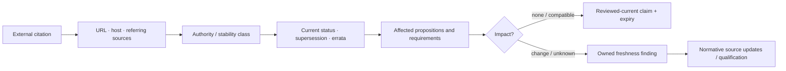

# Normative-source freshness and cross-cutting coverage

**Status:** Accepted foundation governance  
**Authority:** [Architecture consistency and readiness model](README.md)

A citation proves where a claim came from, not that the source is authoritative, current, applicable, or interpreted correctly ([ADR-0152](../../adr/0152-citation-presence-does-not-prove-source-freshness.md)). The generated index inventories every external URL and source document; freshness is a reviewed claim with a bounded date and impact scope.

## Source classes

| Class | Examples | Freshness rule |
|---|---|---|
| Immutable versioned standard | RFC number, dated W3C Recommendation, released Unicode version | Check status, errata, updates, obsoletes/supersedes relations, and applicability; content identity remains version-bound. |
| Living specification | latest-version standards page, browser/API specification | Bind review date or snapshot/version and re-review cadence. |
| Platform contract | Microsoft, Apple, Linux/kernel, freedesktop documentation | Bind supported OS/provider range and review when support baselines or API contracts change. |
| Provider documentation | cloud, database, broker, identity, messaging services | Bind product/version/tier/region and short review cadence. |
| Research/analysis | papers, implementation notes, comparisons | Treat as evidence, not normative authority; record method and limitations. |

## Reviewed core frontier

| Source | Class | Reviewed | Current evidence and impact |
|---|---|---|---|
| [NIST SP 800-53 Rev. 5](https://csrc.nist.gov/pubs/sp/800/53/r5/upd1/final) | Living control catalog | 2026-08-08 | NIST reports Release 5.2.0 dated 2025-08-27 with new/revised controls. Audit-evidence and information-protection mappings require version-qualified impact review; neither document claims universal control equivalence. |
| [WCAG 2.2](https://www.w3.org/TR/WCAG22/) | W3C Recommendation | 2026-08-08 | Current Recommendation is dated 2024-12-12; W3C advises WCAG 2.2 for future applicability while older 2.x Recommendations remain valid. Communication accessibility citation is current and scoped. |
| [Unicode 17.0](https://www.unicode.org/versions/Unicode17.0.0/) | Immutable released standard | 2026-08-08 | Unicode's latest-version endpoint resolves to 17.0.0. Rusty Mill contracts correctly require version evidence rather than silently selecting “latest”; product baselines remain a qualified choice. |
| [RFC 9110](https://www.rfc-editor.org/rfc/rfc9110.html) | Internet Standard, STD 97 | 2026-08-08 | Published June 2022; obsoletes the listed earlier HTTP semantic RFCs and remains the version-bound HTTP semantics authority used by the networking research. Errata/status review remains required at adoption. |

## Freshness findings

| ID | Severity | Finding | Disposition |
|---|---|---|---|
| SF-001 | Medium | NIST SP 800-53 Release 5.2.0 postdates the base Rev. 5 publication cited by two domains. | Preserve current citations, bind mappings to 5.2.0 where control-level claims are added, and perform impact review before Experimental promotion. |
| SF-002 | Medium | Most of the generated external-source inventory has no recorded authority class, review date, version, or expiry. | Migrate by domain; prioritize sources supporting normative platform mappings and security/accessibility claims. |
| SF-003 | Low | Mutable vendor-documentation URLs can change without URL identity changing. | Record snapshot/version evidence in provider trial and release bundles; URL reachability alone is insufficient. |

**RM-READINESS-SOURCE-0001:** A freshness record MUST bind URL or immutable source identity, authority class, reviewed version/status, review date, affected sources/propositions, reviewer, expiry or trigger, and findings.

**RM-READINESS-SOURCE-0002:** Link reachability, a recent page timestamp, or “latest” redirection MUST NOT independently prove applicability or compatibility.

**RM-READINESS-SOURCE-0003:** A source update MUST invalidate affected reviewed-current claims until impact is classified as none, compatible, breaking, security-relevant, or unknown.

**RM-READINESS-SOURCE-0004:** Laws, regulations, compliance frameworks, accessibility policies, cryptographic guidance, and vendor support baselines require qualified specialist review before product or release claims.

## Cross-cutting evidence rules

The generated [quality coverage matrix](quality-matrix.md) distinguishes dedicated analysis from embedded-unreviewed material. Keyword discovery helps route review but cannot prove quality coverage.

**RM-READINESS-QUALITY-0001:** Each domain MUST address security, performance, accessibility, internationalization, observability, and operations with requirements, evidence methods, or explicit justified non-applicability before Experimental promotion.

**RM-READINESS-QUALITY-0002:** A dedicated cross-cutting artifact improves reviewability but MUST NOT count as pass without exact normative claims, verification methods, ownership, and open exceptions.

**RM-READINESS-QUALITY-0003:** Embedded analysis MAY satisfy the gate only through an explicit reviewed matrix that links each dimension to exact sources; keyword occurrence is discovery evidence only.
