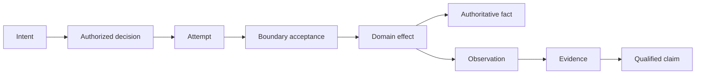

# Canonical shared semantic vocabulary

**Status:** Accepted semantic review baseline  
**Authority:** [Authoritative architecture model](../../01-architecture/architecture-model.md)

The vocabulary defines cross-domain semantic roles, not universal Rust types. Domains may refine a role with a qualified term, but must state the refinement and cannot silently reuse a shared word with contradictory authority or lifecycle semantics ([ADR-0149](../../adr/0149-shared-terms-have-canonical-roles-not-universal-types.md)).

## Canonical roles

| Term | Canonical cross-domain role | Must not imply |
|---|---|---|
| Identity | Stable semantic referent across allowed lifecycle transitions | display name, address, current provider handle, or authority |
| Generation | Immutable revision of a referent, policy, schema, resource, or projection | a new semantic identity unless its identity rules say so |
| Intent | Requested outcome plus purpose and supplied context | authorization, acceptance, execution, or effect |
| Authority | Present permission to make a bounded decision or effect | identity, authentication, possession, eligibility, or historical permission |
| Policy | Versioned decision inputs and rules evaluated in a declared context | enforcement or a successful effect |
| Decision | Policy/authority result for an exact subject, action, resource, context, and generation | later enforcement, provider acceptance, or domain effect |
| Attempt | One bounded execution try under stable logical intent/effect identity | unique domain effect or final outcome |
| Acceptance | A named boundary took responsibility for bounded work or data | downstream delivery, durable commit, observation, or human action |
| Effect | Authoritative domain state transition or externally consequential action | attempt, receipt, event emission, or projection update |
| Receipt | Boundary-scoped evidence of acceptance, commit, or observation with exact semantics | broader success than the issuing boundary can know |
| Fact | State held by the domain authority for its declared subject and generation | universal truth, audit replay authority, or projection freshness |
| Event | Immutable statement that something was observed or asserted in a bounded context | fact truth, effect authority, ordering, or exactly-once delivery |
| Observation | Measured or received evidence with source, time, scope, and quality | causation, authority, completeness, or future state |
| Evidence | Provenance-bearing artifact supporting a scoped claim | claim truth, completeness, compliance, or replay authority |
| Claim | Subject + predicate + scope + evidence frontier + confidence/status | global truth outside that scope |
| Outcome | Terminal or intermediate result at a named boundary | domain completion unless that boundary owns the domain effect |
| State | Value plus identity/generation, authority, time, and consistency context | current authoritative state without those qualifiers |
| Snapshot | Bounded materialization at a stated frontier | full completeness, live freshness, or future continuity |
| Projection | Derived view over authoritative inputs and a known frontier | source-of-truth authority |
| Readiness | Expiring evidence that a boundary can accept a specified class of work | health, eventual success, or authority for effects |
| Health | Expiring boundary-scoped evidence about selected checks | readiness for every operation or business correctness |
| Cancellation | Request to stop or avoid remaining work | terminal completion, rollback, resource release, or absence of effects |
| Retry | New attempt under explicit replay/idempotency policy | safe repetition or a new logical effect by default |
| Correction | New provenance-bearing record that supersedes or qualifies prior evidence/fact | invisible history rewrite |
| Deletion | Domain-defined state transition limiting future availability or visibility | physical erasure from every derived or retained system |

## Qualified homonyms

These words require a domain prefix or explicit boundary when ambiguity exists:

- `session`: application, authentication, synchronization, transport, terminal, or provider session;
- `token`: credential, continuation, cancellation, lease, fencing, device, or lexical token;
- `commit`: database, filesystem, workflow-history, publication, synchronization, or evidence-segment commit;
- `delivery`: provider acceptance, downstream handoff, device receipt, presentation, or domain consumption;
- `version`: semantic contract, schema, artifact, provider, policy, key, resource, or document revision;
- `principal`: OS principal, application subject, service identity, tenant actor, or delegated identity;
- `resource`: native handle, domain object, quota unit, localized asset, or protected authorization target.

**RM-READINESS-VOCAB-0001:** A normative use of a qualified homonym MUST identify its domain or boundary when more than one interpretation is plausible.

**RM-READINESS-VOCAB-0002:** A domain refinement MUST preserve the canonical role's nonclaims or record an explicit mapping and architecture decision.

**RM-READINESS-VOCAB-0003:** Generated indexes MAY discover candidate collisions but MUST NOT decide semantic equivalence from spelling alone.

**RM-READINESS-VOCAB-0004:** Public contracts MUST prefer distinct types for roles whose accidental substitution would grant authority, repeat effects, lose provenance, or overstate evidence.
