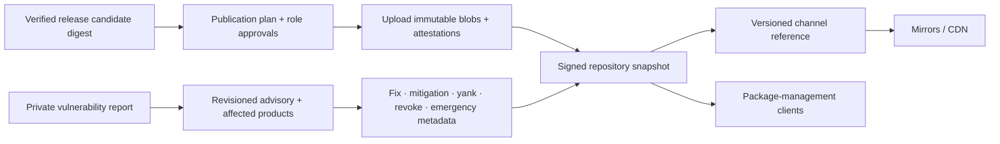

# Repository publication and security-response foundations

| Field | Value |
|---|---|
| Status | Draft ecosystem analysis |
| Purpose | Publish immutable releases, operate authenticated repositories and mirrors, promote channels, issue advisories, and execute emergency response without rewriting history |

## Conclusions

- Publishing, signing, approving, promoting, yanking, advising, revoking, mirroring, and deleting are separately attenuated roles.
- Published artifact identity is immutable. Corrections use new versions or signed metadata/advisory revisions; yanking and channel removal do not rewrite bytes or erase history.
- Channel promotion references the same accepted artifact digest and evidence set. Rebuilding or repackaging creates a different release candidate.
- Repository snapshots commit the complete visible metadata set so consumers can detect rollback, freeze, mix-and-match, and wrong-target attacks.
- Security advisories are signed revisioned evidence with exact product identities and ecosystem-native affected/fixed ranges; severity is contextual evidence, not automatic deployment policy.

## Documents

- [Roles, authority, and ceremonies](roles-authority.md)
- [Publication workflow and release records](publication-workflow.md)
- [Namespaces, ownership, and succession](namespaces-ownership.md)
- [Channels, promotion, yanking, and deprecation](channels-promotion.md)
- [Mirrors, availability, retention, and backup](mirrors-retention.md)
- [Advisory and vulnerability model](advisory-model.md)
- [Coordinated disclosure](coordinated-disclosure.md)
- [Revocation and emergency response](revocation-emergency.md)
- [Ecosystem research](ecosystem-research.md)
- [Conformance](conformance.md)
- [Benchmarks and operational objectives](benchmarks.md)

