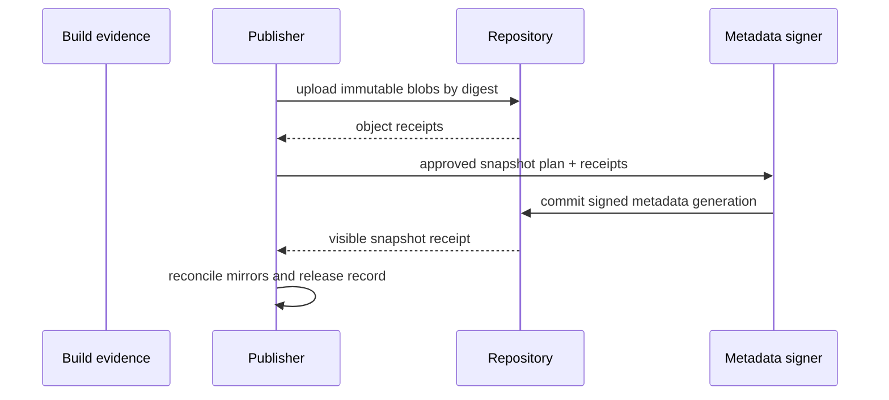

# Publication workflow and release records

**RM-REPOSITORY-PUBLISH-0001:** A release candidate binds source commit/tree, build/workflow definition, toolchain/material locks, artifact digests, package manifests, signatures/timestamps/transparency, provenance/SBOM/licenses/notices, conformance/benchmark results, release notes, compatibility, target/channel eligibility, and known-risk record.

**RM-REPOSITORY-PUBLISH-0002:** Publication input is an immutable plan identifying candidate/evidence digests, namespace/package/version, repository targets, metadata roles, approvals, embargo/publication time, replication policy, and failure/recovery behavior.

**RM-REPOSITORY-PUBLISH-0003:** Preflight proves version/identity availability, ownership/authority, artifact acceptance, required evidence, dependency availability, policy/profile conformance, documentation/change-log completeness, licenses, advisory state, quotas, and repository health.

**RM-REPOSITORY-PUBLISH-0004:** Publication uploads content-addressed immutable objects before referencing metadata. Final metadata commits exact digests/lengths/identities and repository snapshot generation; partial uploads remain unreachable and garbage-collectable.

**RM-REPOSITORY-PUBLISH-0005:** A published release record is immutable and includes repository-native identifiers, source/tag/commit, artifact/evidence digests, publication ceremony, first visible snapshot, channels, and external registry receipts. Provider-generated archives are identified separately from uploaded canonical source artifacts.

**RM-REPOSITORY-PUBLISH-0006:** Retry is idempotent by request and candidate digest. Timeout or provider failure yields reconciled `not published`, `partially uploaded`, `metadata committed`, `visible`, `replicated`, `indeterminate`, or `operator required`, never a guessed success.

**RM-REPOSITORY-PUBLISH-0007:** Published bytes and version identity are never overwritten or reused. A packaging, signing, metadata, license, provenance, or binary correction creates a new version or separately signed metadata/advisory revision as allowed by ecosystem policy.

**RM-REPOSITORY-PUBLISH-0008:** Publication does not itself prove mirror availability, installability, health, compatibility, safety, or channel promotion; those milestones remain separately evidenced.

