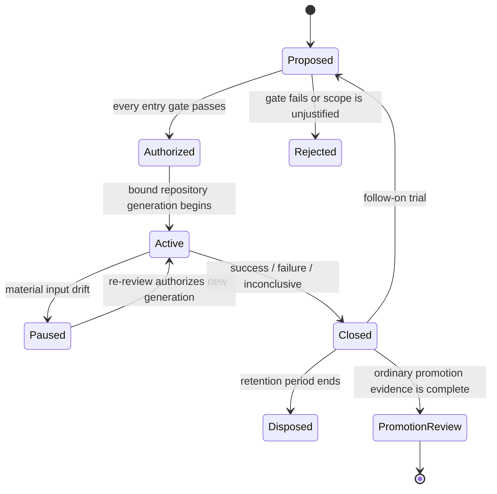

# Implementation trial governance

**Status:** Accepted foundation governance  
**Authority:** [RFC-0002](../../rfc/0002-implementation-trial-governance.md)

An implementation trial is a bounded experiment for resolving named architecture, provider, conformance, or performance uncertainty. It is not permission to start a product, establish a public API, publish a release, or treat trial structure as architectural precedent.

The lifecycle is defined by the [entry gates](entry-gates.md), [trial contract](trial-contract.md), [evidence plan](evidence-plan.md), [repository and CI rules](repository-and-ci.md), [native-provider matrix](native-provider-matrix.md), [change control](change-control.md), [closeout rules](closeout.md), and [review checklist](review-checklist.md). Authors start from the [trial template](trial-template.md).

The [security-foundation batch trial proposal](security-batch-trial-proposal.md) is the first full application of this governance model. It is intentionally blocked because its subjects remain Draft and its exact people, platforms, providers, repository, toolchain, limits, and approvals are unselected. Proposal completeness is not authorization.

The [rustils composed evidence trial proposal](rustils-trial-proposal.md) is a second application, citing an existing external repository ([`baileyrd/rustils`](https://github.com/baileyrd/rustils)) as candidate qualified input evidence for filesystem, process, networking, and security-random/restricted-execution domain work. It is equally blocked: all four subject domains remain Draft, and per RFC-0002's rollout rule, an existing prototype cannot claim retroactive authorization regardless of how complete its own independent evidence is.

**RM-TRIAL-MODEL-0001:** A trial MUST bind one exact authorization generation to named questions, scope, inputs, evidence, owners, limits, and closeout conditions.

**RM-TRIAL-MODEL-0002:** Trial work and results MUST NOT establish Stable API, production support, portability, provider preference, release eligibility, or repository topology by implication.

**RM-TRIAL-MODEL-0003:** Success, failure, and inconclusive outcomes are equally valid learning outcomes and MUST preserve their evidence and limitations.

**RM-TRIAL-MODEL-0004:** A trial MAY inform a later ADR, RFC, contract revision, or promotion review, but only those ordinary governance paths can change architecture or maturity.
