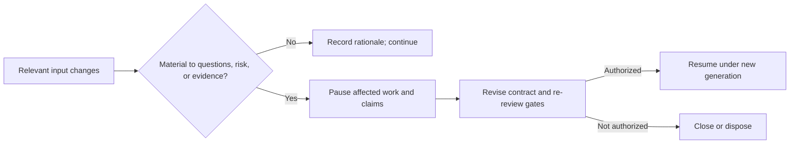

# Trial change control

Authorization is generation-bound rather than perpetual.

**RM-TRIAL-CHANGE-0001:** Changes to architecture, capability semantics/maturity, standards, toolchain, target SDK, provider, dependency risk, unsafe boundary, platform matrix, evidence method, or scope MUST receive recorded materiality review.

**RM-TRIAL-CHANGE-0002:** Material drift immediately suspends affected authorization and claims until a new generation passes entry review.

**RM-TRIAL-CHANGE-0003:** Re-review MUST identify reusable evidence and explain why unchanged inputs preserve validity; evidence reuse MUST NOT be assumed.

**RM-TRIAL-CHANGE-0004:** Emergency safety or security work MAY stop or contain a trial immediately, but continuation still requires ordinary authorization.

