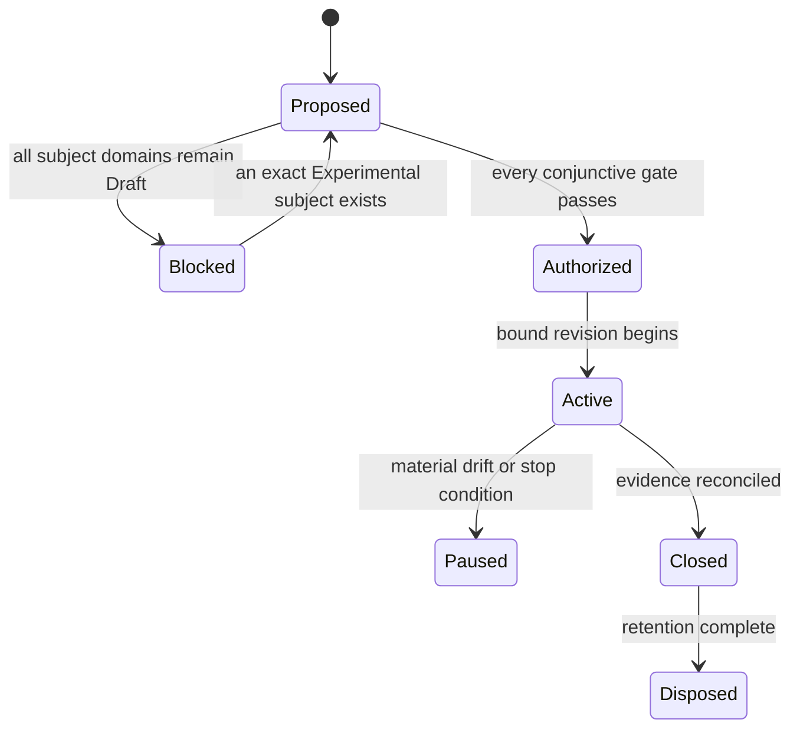

# TRIAL-0002: rustils platform-abstraction composed evidence trial

| Field | Value |
|---|---|
| Status | Proposed; authorization blocked |
| Revision | 0 |
| Owner | rustils trial owner role; named person required before authorization |
| Reviewers | Architecture, filesystem/process/networking/security capability owners, independent standards, evidence, and platform reviewers; named people required |
| Created | 2026-08-10 |
| Authorization expires | No authorization exists; any later authorization expires on bound-input drift or its recorded date |
| Implementation authority | None |

The proposal identifies [`baileyrd/rustils`](https://github.com/baileyrd/rustils) — an independently governed, already-shipping Rust platform-abstraction layer for Linux, Windows, and (net-only) BSD — as a candidate source of qualified input evidence for filesystem, process, networking, and security-random/restricted-execution domain work, and as a candidate future implementation-trial repository once those domains reach an accepted Experimental promotion decision. Per [RFC-0002](../../rfc/0002-implementation-trial-governance.md)'s rollout rule, rustils' existing code and results **cannot claim retroactive authorization**; this proposal treats them strictly as candidate evidence, not as trial output. It does not authorize a repository, dependency, provider call, native/unsafe code, credential, benchmark run, or implementation task.

## Subject and bound generations

Proposed subject: a composed tuple drawn from four Draft domains — [filesystem](../../02-capabilities/filesystem/README.md), [process](../../02-capabilities/process/README.md), [networking](../../02-capabilities/networking/README.md), and the `rm.security.random`/`rm.security.restricted-execution` slices of [security](../../02-capabilities/security/README.md) — architecture model 1.99.0, the future exact Experimental decisions for each domain, a repository standards profile, toolchain, platforms/providers, dependencies, and exceptions, plus this trial's own authorization revision.

No exact subject currently satisfies the entry gate. All four domains are `Draft domain analysis` (per each domain's own `README.md`). Only filesystem and async-io have a written [promotion review](../../02-capabilities/filesystem/promotion-review.md) at all, and filesystem's is itself `Proposed; no maturity change` — not an accepted Experimental decision. Process, networking, and security have no promotion review yet. The trial MUST remain blocked until the selected subset of domains, and every composition dependency, is promotion-eligible for the claimed questions; a candidate evidence repository cannot substitute for a domain's own promotion status.

**Candidate repository generation:** `baileyrd/rustils` at commit `8490b280cd31068300e42e4fbcfc2ce049fb7b18` (main), carrying a Draft [repository standards profile](https://github.com/baileyrd/rustils/blob/main/docs/rusty-mill-profile.md) that itself discloses open gaps (no tracked unsafe budget, no advisory scanning or Miri in CI, no performance-baseline suite) and is not yet Accepted.

**Known taxonomy gap:** rustils' `platform::events::SignalSource` (deferred-signal delivery — install/take, single-entry coalescing slot) has no apparent home in the current capability taxonomy (`docs/02-capabilities/`). It is not proposed as a subject here; resolving or explicitly declining to map it is an open question for domain owners, not assumed by this proposal.

## Questions and hypotheses

rustils arrived at several of its own design decisions independently of Rusty-Mill (its RFC predates this AKB). Several of those decisions appear to converge with, and some appear to diverge from, specific accepted Rusty-Mill ADRs — which is exactly the kind of falsifiable cross-check this trial model exists for.

| ID | Question and hypothesis | Supporting observation | Refuting observation | Inconclusive condition | Decision informed |
|---|---|---|---|---|---|
| `RT-001` | Does rustils' `OsStr`/`OsString`-only path boundary (D-11, chosen because "the one place raw units matter uses `&[u16]`, which a byte newtype would not have served") satisfy [ADR-0006](../../adr/0006-paths-are-lossless-native-values.md)'s lossless-native-value requirement? | rustils' boundary round-trips every path its parity suite exercises on both OSes without lossy conversion | a Windows namespace grammar or non-UTF-8 POSIX name that `OsStr` cannot represent losslessly is identified | no case distinguishing `OsStr` from ADR-0006's native value model is found on either platform | filesystem contract's path-model chapter |
| `RT-002` | Does rustils' capability-style `Dir`/`File` (handle-relative `open`/`open_dir`, D-6) already satisfy [ADR-0007](../../adr/0007-directory-relative-resolution-is-the-security-boundary.md)'s directory-relative-resolution security boundary, including its requirement that providers *disclose* link/reparse/mount/ancestor-race protection strength? | every `Dir` resolution rustils ships begins from an explicit opened directory, never ambient cwd | rustils' behavior spec (`docs/behavior/fs.md`) is found to assert containment from lexical normalization alone, or omits disclosing race-protection strength | the parity suite does not exercise a link/reparse/mount race on either backend | filesystem contract's resolution-quality chapter |
| `RT-003` | Does rustils' `Spawner::spawn` (direct launch, argv-only, no shell) plus a separate `Spawner::resolve` already satisfy [ADR-0014](../../adr/0014-direct-process-launch-is-the-base-contract.md) and [ADR-0016](../../adr/0016-executable-search-uses-explicit-authority.md)'s split between launch and search? | rustils' `resolve` is already an independent method, never invoked implicitly by `spawn`, matching ADR-0016's "independent capability" framing | rustils' `resolve` is found not to report lookup strength or a replacement-race disclosure the way ADR-0016 requires, or its Windows argument-quoting (`winargv`) claims round-trip fidelity ADR-0014 says providers cannot universally claim | the parity suite does not exercise a PATH race or an unrepresentable-argument refusal case | process contract's spawn and executable-resolve chapters |
| `RT-004` | Does rustils' current async story — raw-fd/socket escape hatches for an external reactor (documented in rustils' `docs/architecture.md` Execution and concurrency model) — satisfy [ADR-0052](../../adr/0052-portable-asynchronous-io-is-completion-oriented.md)'s completion-oriented preference, or does it only satisfy it where the native mechanism is already completion-oriented (Windows IOCP via `WaitForMultipleObjects`), while Linux/BSD stay readiness-based against ADR-0052's stated model? | rustils' Windows `wait_any` path is IOCP/`WaitForMultipleObjects`-driven, naturally completion-oriented | rustils' Linux/BSD `Net` escape hatch is readiness-based (epoll/kqueue via an external reactor) with no completion-oriented framing in `platform` itself, a candidate genuine divergence from ADR-0052 | no async-io domain contract yet exists to compare against, since async-io is also Draft | async-io contract's operation-model and runtime-integration chapters |
| `RT-005` | Does rustils' `wait_any` cancellation model (borrows, does not consume, `&mut [Box<dyn Child>]`; no partial reap on drop) already satisfy [ADR-0053](../../adr/0053-cancellation-does-not-end-operation-lifetime.md)'s "cancellation does not end operation lifetime, exactly one terminal completion" formalism? | rustils' own behavior spec (`docs/behavior/process.md`) documents that a caller who stops polling `wait_any` leaves every child unaffected, and the winning child's exit status is reaped and stashed exactly once | rustils has no explicit "exactly one terminal completion is observed" formalism and no case proving double-completion is structurally impossible beyond `Child::wait`'s consuming signature | no case exercises cancellation of `wait_any` mid-multiplex on the native (non-fallback) reactor path | async-io contract's cancellation-lifetime chapter |
| `RT-006` | Do rustils' `Sandbox` (Landlock/seccomp confinement) and `CredentialStore` already keep identity separate from authority per [ADR-0009](../../adr/0009-identity-is-not-authority.md), and treat the native confinement/keychain call itself as the authorization point per [ADR-0010](../../adr/0010-native-operation-is-the-authorization-point.md)? | rustils' `Sandbox::confine_filesystem`/`block_inet_sockets` are irreversible native calls with no separate advisory pre-check API | rustils is found to expose or imply an advisory "would this be allowed" check ADR-0010 would classify as non-authoritative, or to treat a credential lookup's mere presence as authority rather than evidence | security domain contracts (Draft) don't yet define what "authority" means precisely enough to compare | security contract's authority-model and restricted-execution chapters |

## Scope, limits, and nonclaims

**Included only after authorization:** structured reading of rustils' existing source, behavior specs, parity-suite results, and CI configuration as candidate qualified input evidence for the domains above; a written comparison record per hypothesis; no new code.

**Excluded:** creating or modifying a rustils repository generation under this trial's authority, any provider call, any credential/secret/random material, any benchmark run, any claim that rustils "is" a Rusty-Mill implementation, any product integration, any release, any change to rustils' own independent governance (`rfc-v2.md`) by this trial's authority.

**Initial limits:** read-only comparison against rustils' public repository at the bound commit; no execution of rustils' test/parity/fuzz suites under this trial's own infrastructure (their prior CI results are cited as candidate evidence, not re-executed as trial evidence, until an authorized verification plan exists); no named limit on wall time is set here — that is an authorization input, not guessed in a blocked proposal.

**Nonclaims:** conformance, certification, portability, provider preference, production safety, security strength, native performance, maturity, API stability, crate/repository/package topology, or permission to implement. rustils' existing shipped behavior is not thereby endorsed, adopted, or declared Rusty-Mill-conformant by this proposal existing.

## Provider matrix and variance

| Dimension | Windows | Linux | macOS/BSD |
|---|---|---|---|
| Exact OS/SDK/kernel and deployment | rustils: `windows-latest` CI, MSVC | rustils: `ubuntu-latest` CI, glibc | rustils: `platform-bsd` net-only, real-hardware CI job — unselected as a trial subject beyond networking |
| Filesystem/process authority mechanisms | rustils has native coverage (`platform-windows`) | rustils has native coverage (`platform-linux`, Landlock/seccomp) | No rustils filesystem/process backend exists (`platform-bsd` is net-only, per rustils' own coverage matrix) — candidate evidence gap, not a blocking unknown for this proposal since macOS filesystem/process are not proposed subjects |
| Networking (`Net`) | rustils has native coverage | rustils has native coverage | rustils has native coverage (BSD family, kqueue-reactor forcing consumer) |
| Async/readiness vs completion | IOCP-driven (`WaitForMultipleObjects`), completion-oriented | epoll-driven raw-fd escape hatch, readiness-oriented | kqueue-driven raw-fd escape hatch, readiness-oriented — same RT-004 divergence question as Linux |
| Fault, lifecycle, conformance, benchmark support | rustils parity suite covers this today (existing evidence, not trial-executed) | rustils parity suite covers this today (existing evidence, not trial-executed) | rustils real-hardware CI job covers networking only |

Unsupported or unobserved combinations (macOS/BSD filesystem and process) are recorded as such and are not proposed as subjects here.

## Evidence plan

| Evidence class | Bound plan |
|---|---|
| Candidate input evidence | rustils' `docs/behavior/{fs,process,net,security}.md`, `docs/architecture.md`, `docs/rusty-mill-profile.md`, and CI results at the bound commit — cited, not re-executed, per RFC-0002's "clearly qualified input evidence" allowance |
| Comparison record | one written finding per `RT-00N` hypothesis: supported / refuted / inconclusive, with exact rustils source citation and exact ADR/contract citation |
| Variance | exact platform/backend coverage gaps recorded as such (e.g., no macOS/BSD filesystem or process backend) — not normalized or treated as equivalent to native evidence |
| Provenance | rustils commit SHA, this AKB's architecture-model version, and this proposal's revision are bound together; any later authorization records the new generations |

No benchmark, fuzz, or live-provider execution is planned under this trial's own authority until authorized; existing rustils CI results remain rustils' own evidence, attributed as such.

## Repository and operations

No repository is authorized or selected under this trial's own authority. `baileyrd/rustils` remains an externally, independently governed repository throughout the Proposed and (if reached) Blocked-to-Authorized states; this trial does not gain write access, CI trust, or operational authority over it. A later authorization, if any, would bind: which rustils commit/tag generation is cited, the reviewer(s) performing the comparison, and where the comparison record is published (candidate: a new `docs/02-capabilities/<domain>/rustils-comparison.md` per subject domain, linked from that domain's `promotion-review.md`).

## Risks and stop conditions

Stop immediately on: any drift of rustils' cited commit that changes a hypothesis's supporting/refuting evidence without the comparison record being re-reviewed; any attempt to treat this proposal's existence as authorization to depend on, vendor, or fork rustils code; any attempt to represent rustils' own CI results as trial-executed conformance evidence; any attempt to skip a domain's own promotion-review gate on the strength of external evidence alone.

The trial owner may pause more conservatively. Only the authorizing authority may approve a revised generation after architecture, capability-owner, and standards review.

## Gate review and decision

| Gate | State | Evidence | Reviewer | Expiry/qualification |
|---|---|---|---|---|
| Subject | Fail | filesystem, process, networking, security all `Draft domain analysis`; only filesystem has a promotion review, itself undecided | Capability owners and architecture reviewer: unnamed | blocks authorization |
| Learning value | Qualified | `RT-001`–`RT-006` are falsifiable and cite exact rustils source and exact accepted ADRs; exact selected subset may narrow on review | Architecture and evidence reviewers: unnamed | review required |
| Bounds | Unknown | scope/nonclaims/exclusions defined; numeric time/review-effort limits unselected | Trial owner and standards reviewer: unnamed | review required |
| Ownership | Unknown | accountable roles defined; named people, independence, and availability absent | Authorizing maintainer: unnamed | blocks authorization |
| Repository | Qualified | rustils carries a Draft standards profile (`docs/rusty-mill-profile.md`) disclosing its own gaps; profile is not Accepted and binds no Rusty-Mill generation yet | Standards reviewer: unnamed | blocks authorization |
| Verification | Qualified | candidate evidence sources identified and cited exactly; no trial-bound verification protocol, re-execution plan, or independent evidence collection exists | Evidence reviewer: unnamed | blocks authorization |
| Cross-cutting | Unknown | no named review of security/accessibility/i18n/observability/performance implications of the comparison work itself has occurred | Quality reviewers: unnamed | blocks authorization |
| Operations | Not applicable | this trial performs no code execution, provider call, or CI activity under its own authority — read/compare only | — | qualifies, does not fail |

**Decision: Not authorized.** Entry is conjunctive; one `Fail` and every `Unknown` independently block work. A well-cited proposal, an existing external repository, or informal maintainer overlap between rustils and this AKB cannot override these states.

## Change log

| Revision | Date | Change | Authority impact |
|---|---|---|---|
| 0 | 2026-08-10 | Initial evidence-first proposal citing `baileyrd/rustils` as candidate input evidence | None; authorization blocked |

## Closeout

Not applicable while unauthorized. A later authorized trial cannot close until each `RT-00N` hypothesis has a supported/refuted/inconclusive disposition with exact citations, the comparison record is published per subject domain, and a follow-on ADR/RFC/promotion-review proposal or explicit no-change decision is named for each domain touched.

**RM-RUSTILS-TRIAL-0001:** This proposal MUST remain non-authorizing while any subject domain is Draft or any gate is failed, unknown, expired, contradictory, or lacks named accountable approval.

**RM-RUSTILS-TRIAL-0002:** A later authorization MUST bind one exact proposal revision, architecture model, Experimental subject-domain tuple, the exact rustils commit/tag generation cited, standards/repository/toolchain generations, hypotheses, limits, evidence plan, people, expiry, and closeout.

**RM-RUSTILS-TRIAL-0003:** Citing rustils as candidate input evidence MUST NOT be represented as Rusty-Mill conformance, promotion, or endorsement of rustils, and MUST NOT be represented by rustils' own documentation as Rusty-Mill authorization until this record's status changes.

**RM-RUSTILS-TRIAL-0004:** Comparison findings MUST remain scoped evidence and MUST NOT independently change architecture, maturity, provider selection, or the affected domain's promotion status; only the domain's own promotion-review path can do that.
