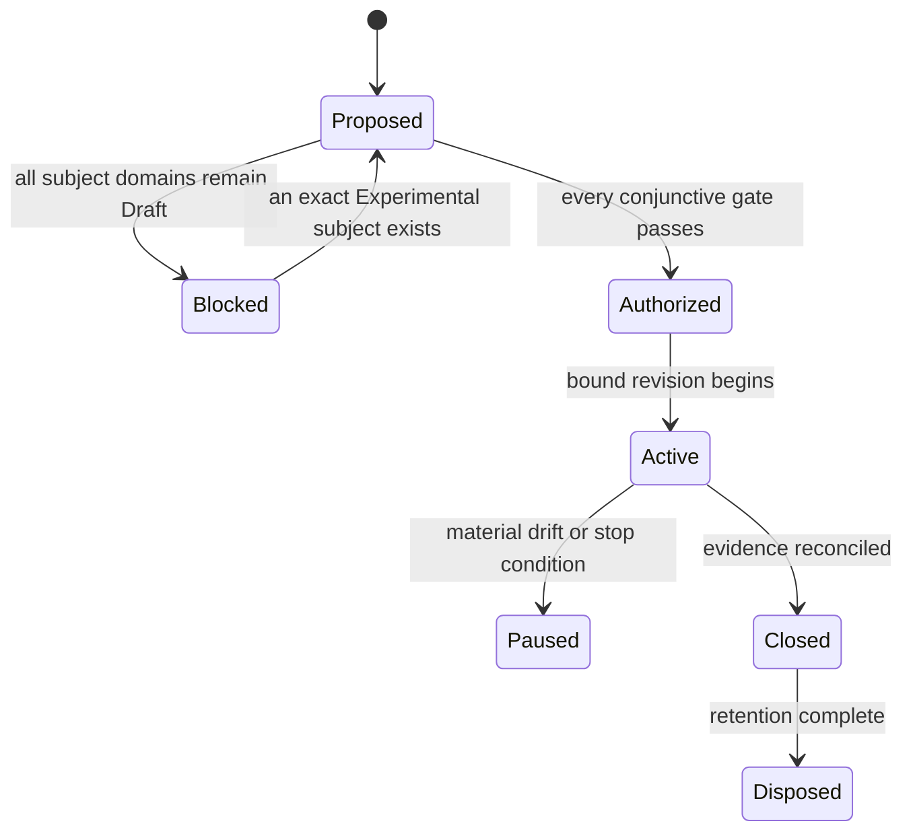

# TRIAL-0002: rustils filesystem composed evidence trial

| Field | Value |
|---|---|
| Status | Proposed; authorization blocked |
| Revision | 1 — narrowed to filesystem only (see Change log) |
| Owner | rustils trial owner role; named person required before authorization |
| Reviewers | Filesystem capability owner, independent architecture, standards, evidence, and platform reviewers; named people required |
| Created | 2026-08-10 |
| Authorization expires | No authorization exists; any later authorization expires on bound-input drift or its recorded date |
| Implementation authority | None |

The proposal identifies [`baileyrd/rustils`](https://github.com/baileyrd/rustils) — an independently governed, already-shipping Rust platform-abstraction layer for Linux, Windows, and (net-only) BSD — as a candidate source of qualified input evidence for **filesystem** domain work, and as a candidate future implementation-trial repository now that filesystem holds an accepted Experimental promotion decision. Per [RFC-0002](../../rfc/0002-implementation-trial-governance.md)'s rollout rule, rustils' existing code and results **cannot claim retroactive authorization**; this proposal treats them strictly as candidate evidence, not as trial output. It does not authorize a repository, dependency, provider call, native/unsafe code, credential, benchmark run, or implementation task.

Revision 0 composed a four-domain tuple (filesystem, process, networking, security). Revision 1 narrows to filesystem alone — see Change log. Process, networking, and security remain Draft with no promotion review; a future trial revisiting them needs its own materiality review and revision, not a silent re-widening of this one.

## Subject and bound generations

Proposed subject: [filesystem](../../02-capabilities/filesystem/README.md) alone — architecture model 1.99.0, filesystem's [accepted Experimental promotion decision](../../02-capabilities/filesystem/promotion-review.md) (2026-08-10), a repository standards profile, toolchain, platforms/providers, dependencies, and exceptions, plus this trial's own authorization revision.

**Subject gate: now satisfiable for filesystem specifically.** Filesystem's promotion review moved from `Proposed; no maturity change` to **Accepted — Draft to Experimental** on 2026-08-10, bound to an exact, narrow scope: directory/resolution/file/metadata/atomic-replacement/durability contracts, with an exact R/D-level baseline (Linux `open_dir`/`create_dir` R2, `write_atomic` D2; Windows same ops R2 link-confinement-only, `write_atomic` D1; everything else R1 on both backends; no R3/D3 claimed anywhere; Linux mount-crossing containment requested but not test-verified; no macOS/BSD filesystem backend exists at all). A future trial authorization for filesystem is bound to exactly that scope, not to "filesystem" unqualified — anything the promotion review excluded (R3/D3, mount-crossing verification, non-Core-local tiers, product/policy selection, cross-cutting/performance findings) is equally excluded here.

Process, networking, and security remain `Draft domain analysis` with no accepted (or, for process/networking/security, even proposed) promotion review — they are **removed from this trial's subject** by this revision (see Change log), not merely deprioritized. Async-io also has a written promotion review, itself still `Proposed`, and was never part of this trial's original tuple.

**Candidate repository generation:** `baileyrd/rustils` at commit `cc1c699130c1ed92428e2a9003f81dc0732e0305` (main, as of rustils#122 — the R2/D2 filesystem work this evidence cites), carrying a Draft [repository standards profile](https://github.com/baileyrd/rustils/blob/main/docs/rusty-mill-profile.md) that itself discloses open gaps (no tracked unsafe budget, no advisory scanning or Miri in CI, no performance-baseline suite) and is not yet Accepted.

**Known taxonomy gap (no longer this trial's concern):** rustils' `platform::events::SignalSource` had no apparent home in the capability taxonomy — irrelevant to a filesystem-only trial; noted here only because revision 0 flagged it under a broader tuple that no longer applies.

## Questions and hypotheses

rustils arrived at several of its own design decisions independently of Rusty-Mill (its RFC predates this AKB). Several of those decisions appear to converge with, and some appear to diverge from, specific accepted Rusty-Mill ADRs — which is exactly the kind of falsifiable cross-check this trial model exists for.

| ID | Question and hypothesis | Supporting observation | Refuting observation | Inconclusive condition | Decision informed |
|---|---|---|---|---|---|
| `RT-001` | Does rustils' `OsStr`/`OsString`-only path boundary (D-11, chosen because "the one place raw units matter uses `&[u16]`, which a byte newtype would not have served") satisfy [ADR-0006](../../adr/0006-paths-are-lossless-native-values.md)'s lossless-native-value requirement? | rustils' boundary round-trips every path its parity suite exercises on both OSes without lossy conversion | a Windows namespace grammar or non-UTF-8 POSIX name that `OsStr` cannot represent losslessly is identified | no case distinguishing `OsStr` from ADR-0006's native value model is found on either platform | filesystem contract's path-model chapter |
| `RT-002` | Does rustils' capability-style `Dir`/`File` (handle-relative `open`/`open_dir`, D-6) already satisfy [ADR-0007](../../adr/0007-directory-relative-resolution-is-the-security-boundary.md)'s directory-relative-resolution security boundary, including its requirement that providers *disclose* link/reparse/mount/ancestor-race protection strength? | rustils' [candidate R/D-level evidence](../../02-capabilities/filesystem/promotion-review.md#candidate-rd-level-evidence-external-non-authoritative) now shows disclosed, atomic containment for `open_dir`/`create_dir` (R2 on Linux, link-confinement-only R2 on Windows), not just anchoring | the promotion review's own excluded-scope list stands: no test verifies Linux mount-crossing rejection, `open`/`access`/`metadata`/etc. remain R1 (symlinks followed transparently) by design, and no backend claims R3/beneath-confinement | the parity suite still does not exercise a mount-crossing race on either backend, and Windows has no mount-confinement mechanism to test at all | filesystem contract's resolution-quality chapter — this hypothesis has moved from "does R1 satisfy the boundary" to "does the now-evidenced R2 subset, and its documented R1 remainder, satisfy it precisely as scoped" |

Revision 0's `RT-003`–`RT-006` (process launch/search, async-io completion model, security identity-vs-authority) are **removed** by this revision, not answered — they belonged to domains no longer in this trial's subject. A future process/networking/security-scoped trial would need its own proposal, informed by whatever those domains' own promotion reviews eventually bind, not a resurrection of these hypotheses under this trial's authority.

## Scope, limits, and nonclaims

**Included only after authorization:** structured reading of rustils' existing filesystem source, `docs/behavior/fs.md`, `docs/divergences.md` #013/#014, parity-suite results, and CI configuration as candidate qualified input evidence for the filesystem domain; a written comparison record per hypothesis; no new code.

**Excluded:** creating or modifying a rustils repository generation under this trial's authority, any provider call, any credential/secret/random material, any benchmark run, any claim that rustils "is" a Rusty-Mill implementation, any product integration, any release, any change to rustils' own independent governance (`rfc-v2.md`) by this trial's authority, and anything touching process/networking/security (removed from subject by this revision).

**Initial limits:** read-only comparison against rustils' public repository at the bound commit; no execution of rustils' test/parity/fuzz suites under this trial's own infrastructure (their prior CI results are cited as candidate evidence, not re-executed as trial evidence, until an authorized verification plan exists); no named limit on wall time is set here — that is an authorization input, not guessed in a blocked proposal.

**Nonclaims:** conformance, certification, portability, provider preference, production safety, security strength, native performance, maturity, API stability, crate/repository/package topology, or permission to implement. rustils' existing shipped behavior is not thereby endorsed, adopted, or declared Rusty-Mill-conformant by this proposal existing.

## Provider matrix and variance

| Dimension | Windows | Linux | macOS/BSD |
|---|---|---|---|
| Exact OS/SDK/kernel and deployment | rustils: `windows-latest` CI, MSVC | rustils: `ubuntu-latest` CI, glibc | no rustils filesystem backend exists at all (`platform-bsd` is net-only) — not proposed as a subject |
| Filesystem authority mechanisms | `NtCreateFile` + `RootDirectory` anchoring; `OBJ_DONT_REPARSE` for `open_dir`/`create_dir` (R2, link-confinement only — no NT mount-confinement flag exists) | `openat`/`*at` family anchoring; `openat2` `RESOLVE_NO_SYMLINKS\|RESOLVE_NO_XDEV` for `open_dir`/`create_dir` (R2, 5.6+ kernel, falls back to R1) | out of scope — no backend to evaluate |
| Directory durability (`write_atomic`) | `FlushFileBuffers` on the file only — D1; no verified directory-handle-flush guarantee, so D2 is not claimed | `fsync` on both the file and (after this revision's cited evidence) the containing directory fd — D2, strace-verified | out of scope |
| Fault, lifecycle, conformance, benchmark support | rustils parity suite covers this today, including the new symlink-rejection parity tests (existing evidence, not trial-executed) | same, plus the strace-verified directory-fsync-ordering test | not applicable |

Unsupported or unobserved combinations (macOS/BSD filesystem entirely; Linux mount-crossing containment specifically) are recorded as such and are not proposed as subjects here.

## Evidence plan

| Evidence class | Bound plan |
|---|---|
| Candidate input evidence | rustils' `docs/behavior/fs.md`, `docs/divergences.md` #013/#014, `docs/rusty-mill-profile.md`, and CI results at the bound commit — cited, not re-executed, per RFC-0002's "clearly qualified input evidence" allowance |
| Comparison record | one written finding per `RT-00N` hypothesis: supported / refuted / inconclusive, with exact rustils source citation and exact ADR/contract citation |
| Variance | exact platform/backend coverage gaps recorded as such (no macOS/BSD filesystem backend; Linux mount-crossing containment requested but not test-verified; Windows has no mount-confinement mechanism at all) — not normalized or treated as equivalent to native evidence |
| Provenance | rustils commit SHA, this AKB's architecture-model version, filesystem's promotion-review decision date, and this proposal's revision are bound together; any later authorization records the new generations |

No benchmark, fuzz, or live-provider execution is planned under this trial's own authority until authorized; existing rustils CI results remain rustils' own evidence, attributed as such.

## Repository and operations

No repository is authorized or selected under this trial's own authority. `baileyrd/rustils` remains an externally, independently governed repository throughout the Proposed and (if reached) Blocked-to-Authorized states; this trial does not gain write access, CI trust, or operational authority over it. A later authorization, if any, would bind: which rustils commit/tag generation is cited, the reviewer(s) performing the comparison, and where the comparison record is published (candidate: a new `docs/02-capabilities/<domain>/rustils-comparison.md` per subject domain, linked from that domain's `promotion-review.md`).

## Risks and stop conditions

Stop immediately on: any drift of rustils' cited commit that changes a hypothesis's supporting/refuting evidence without the comparison record being re-reviewed; any attempt to treat this proposal's existence as authorization to depend on, vendor, or fork rustils code; any attempt to represent rustils' own CI results as trial-executed conformance evidence; any attempt to skip a domain's own promotion-review gate on the strength of external evidence alone.

The trial owner may pause more conservatively. Only the authorizing authority may approve a revised generation after architecture, capability-owner, and standards review.

## Gate review and decision

| Gate | State | Evidence | Reviewer | Expiry/qualification |
|---|---|---|---|---|
| Subject | **Pass** (as of revision 1) | filesystem's [promotion review](../../02-capabilities/filesystem/promotion-review.md) is Accepted — Draft to Experimental, 2026-08-10, scoped exactly to the contracts and R/D levels bound there | Filesystem capability owner: baileyrd (bootstrap staffing, see the promotion review's own Named ownership section) | bound to that exact decision generation; any later amendment to the promotion review requires materiality review here too (`RM-TRIAL-CHANGE-0001`) |
| Learning value | Qualified | `RT-001`/`RT-002` are falsifiable and cite exact rustils source and exact accepted ADRs; `RT-002` specifically now tests the *evidenced* R2 subset against ADR-0007, not a hypothetical one | Architecture and evidence reviewers: unnamed | review required |
| Bounds | Unknown | scope/nonclaims/exclusions defined and now narrower (filesystem only); numeric time/review-effort limits still unselected | Trial owner and standards reviewer: unnamed | review required |
| Ownership | Unknown | accountable roles defined; named people, independence, and availability absent for the *trial* (distinct from the promotion review's own bootstrap naming, which does not itself staff this trial) | Authorizing maintainer: unnamed | blocks authorization |
| Repository | Qualified | rustils carries a Draft standards profile (`docs/rusty-mill-profile.md`) disclosing its own gaps; profile is not Accepted and binds no Rusty-Mill generation yet | Standards reviewer: unnamed | blocks authorization |
| Verification | Qualified | candidate evidence sources identified and cited exactly, including the strace-verified D2 test and the symlink-rejection parity tests; no trial-bound verification protocol, re-execution plan, or independent evidence collection exists | Evidence reviewer: unnamed | blocks authorization |
| Cross-cutting | Unknown | no named review of security/accessibility/i18n/observability/performance implications of the comparison work itself has occurred | Quality reviewers: unnamed | blocks authorization |
| Operations | Not applicable | this trial performs no code execution, provider call, or CI activity under its own authority — read/compare only | — | qualifies, does not fail |

**Decision: Not authorized.** Entry is conjunctive; Subject clearing does not clear the rest. Every remaining `Unknown` independently blocks work — Bounds, Ownership, Cross-cutting are unreviewed, and Repository/Verification stay `Qualified`, not `Pass`. A well-cited proposal, an existing external repository, an accepted promotion decision for the *domain*, or informal maintainer overlap between rustils and this AKB cannot override these states (`RM-TRIAL-ENTRY-0002`).

## Change log

| Revision | Date | Change | Authority impact |
|---|---|---|---|
| 0 | 2026-08-10 | Initial evidence-first proposal citing `baileyrd/rustils` as candidate input evidence across four Draft domains | None; authorization blocked |
| 1 | 2026-08-10 | Materiality review (`RM-TRIAL-CHANGE-0001`): filesystem's promotion review moved from `Proposed` to Accepted — Draft to Experimental, changing the Subject gate's own state for that one domain. Narrowed this trial's subject to filesystem alone; removed process, networking, and security (still Draft, no promotion review) rather than silently carrying gates they'd fail forward. Dropped `RT-003`–`RT-006` (those domains' hypotheses); revised `RT-002` to test the now-evidenced R2 subset. Rebased the candidate repository generation to `cc1c699130c1ed92428e2a9003f81dc0732e0305` (rustils#122, the R2/D2 work). Subject gate moved Fail → Pass; every other gate is unchanged (`Unknown`/`Qualified`) — reusable per `RM-TRIAL-CHANGE-0003`, since none of them depended on the domain count | Subject gate only; still `Not authorized` overall |

## Closeout

Not applicable while unauthorized. A later authorized trial cannot close until each `RT-00N` hypothesis has a supported/refuted/inconclusive disposition with exact citations, the comparison record is published per subject domain, and a follow-on ADR/RFC/promotion-review proposal or explicit no-change decision is named for each domain touched.

**RM-RUSTILS-TRIAL-0001:** This proposal MUST remain non-authorizing while any subject domain is Draft or any gate is failed, unknown, expired, contradictory, or lacks named accountable approval.

**RM-RUSTILS-TRIAL-0002:** A later authorization MUST bind one exact proposal revision, architecture model, Experimental subject-domain tuple, the exact rustils commit/tag generation cited, standards/repository/toolchain generations, hypotheses, limits, evidence plan, people, expiry, and closeout.

**RM-RUSTILS-TRIAL-0003:** Citing rustils as candidate input evidence MUST NOT be represented as Rusty-Mill conformance, promotion, or endorsement of rustils, and MUST NOT be represented by rustils' own documentation as Rusty-Mill authorization until this record's status changes.

**RM-RUSTILS-TRIAL-0004:** Comparison findings MUST remain scoped evidence and MUST NOT independently change architecture, maturity, provider selection, or the affected domain's promotion status; only the domain's own promotion-review path can do that.
