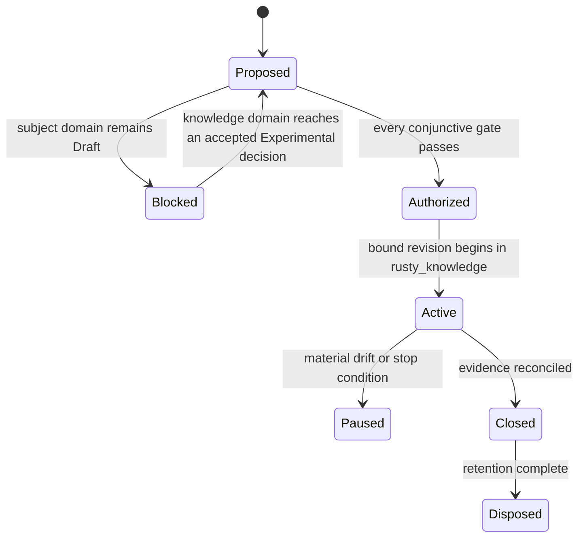

# TRIAL-0003: Rusty Knowledge domain-framework implementation trial

| Field | Value |
|---|---|
| Status | Proposed; authorization blocked |
| Revision | 0 |
| Owner | David Bailey ([@baileyrd](https://github.com/baileyrd)) |
| Reviewers | David Bailey ([@baileyrd](https://github.com/baileyrd)) holds every role below. Per [RFC-0004](../../rfc/0004-solo-maintainer-review-sufficiency.md)'s solo-maintainer mode this satisfies the independence expectation itself; it does not substitute for the substantive review work each gate still needs |
| Created | 2026-08-10 |
| Authorization expires | No authorization exists; any later authorization expires on bound-input drift or its recorded date |
| Implementation authority | None |

The proposal specifies the entry review for the implementation trial [RFC-0003](../../rfc/0003-rusty-knowledge-domain-framework.md) authorized: re-implement the 15 MCP tools and layered-authority/conflict-registry semantics of the existing, working `baileyrd/knowledge-mcp` Python server in Rust, in [`rusty-mill/rusty_knowledge`](https://github.com/Rusty-Mill/rusty_knowledge) (currently empty). It does not authorize a dependency, provider call, native/unsafe code, credential, benchmark run, or the first commit.

## Subject and bound generations

Proposed subject: the `knowledge` domain framework ([README](../../02-capabilities/knowledge/README.md)), architecture model 1.99.0, RFC-0003 (Draft; not yet Accepted at the time of this entry review), ADR-0164 and ADR-0165 (Proposed), a future exact Experimental promotion decision for `knowledge`, a repository standards profile for `rusty_knowledge`, toolchain, platforms/providers, dependencies, and exceptions, plus this trial's own authorization revision.

No exact subject currently satisfies the entry gate. The `knowledge` domain is `Draft domain analysis` per its own [README.md](../../02-capabilities/knowledge/README.md). `promotion-review.md`, `cross-cutting.md`, and `ownership.md` now exist — the prerequisites [ADR-0164](../../adr/0164-rusty-knowledge-is-a-domain-framework.md)'s follow-up and RFC-0003's rollout plan named — but none resolves the domain to Accepted; `source-review.md` still doesn't exist. `rusty_knowledge` has a bootstrap commit (license, README, a Draft standards profile) but no Accepted profile and no implementation code. This mirrors exactly why [TRIAL-0001](security-batch-trial-proposal.md) and [TRIAL-0002](rustils-trial-proposal.md) remain blocked, and per RFC-0002's rollout rule, RFC-0003's existence, `knowledge-mcp`'s independent maturity, or `rusty_knowledge`'s own bootstrap commit cannot substitute for the domain's own promotion status.

**Candidate input evidence generation:** `baileyrd/knowledge-mcp` at its current default-branch commit (single squashed history; `v0.1.0` in `pyproject.toml`), cited per RFC-0002's "clearly qualified input evidence" allowance, not as trial output.

## Questions and hypotheses

| ID | Question and hypothesis | Supporting observation | Refuting observation | Inconclusive condition | Decision informed |
|---|---|---|---|---|---|
| `RK-001` | Does `knowledge-mcp`'s four-layer authority model (Standard → Tool Implementation → Conventions → Process) map cleanly onto a Rust type that makes an unlabeled (layer-less) answer unrepresentable, as [RM-KNOWLEDGE-MODEL-0002](../../02-capabilities/knowledge/model.md) requires? | A Rust response type compiles such that every returned rule carries a non-optional authority-layer field | The layered model requires an escape hatch (an "unknown layer" state) that the Python implementation never needed, indicating semantic loss in translation | The comparison corpus never exercises a rule whose layer is ambiguous in the Python source | `knowledge` capability specification's semantic-model chapter |
| `RK-002` | Does the Python conflict registry's cross-layer contradiction recording survive re-implementation without becoming silent precedence resolution, per [ADR-0165](../../adr/0165-knowledge-layered-authority-carries-over-as-a-requirement.md)? | The Rust implementation's `crosscut.conflicts` reports the same contradictions, with the same disposition, as the Python server for a fixed comparison corpus | The Rust implementation resolves a contradiction internally (e.g., "highest layer wins") without recording it in a queryable registry | The comparison corpus contains no genuine cross-layer contradiction to exercise | `knowledge` capability specification's conflict-registry chapter |
| `RK-003` | Does multi-domain hosting (one server instance, N namespaced domains) hold under a Rust storage/query design without cross-domain leakage, per [RM-KNOWLEDGE-MODEL-0001](../../02-capabilities/knowledge/model.md)? | `meta.list_domains` and scoped lookups return only the queried domain's constructs across at least two loaded domains | A query scoped to one domain returns or is influenced by another domain's rules or constructs | Only one domain (UAF 1.3) has real content; `data_mesh`/`udra` remain stubs, limiting the leakage test's realism | `knowledge` capability specification's domain-isolation chapter |
| `RK-004` | Does hybrid (lexical + vector) retrieval remain the declared default with discoverable degradation, per [RM-KNOWLEDGE-MODEL-0005](../../02-capabilities/knowledge/model.md), once mapped onto a Rust SQLite/vector-search binding? | Search responses carry a retrieval-mode field, and a forced-degraded fixture shows it flip to lexical-only rather than silently substituting | No Rust crate combination is found that exposes FTS5 plus a comparable vector-search extension without bespoke native glue exceeding the trial's dependency limits | No credible Rust vector-search crate is evaluated within the trial's time bound | `knowledge` platform-research and the domain's eventual capability graph edges into `search` |
| `RK-005` | Is the MCP transport (Streamable HTTP/ASGI in Python) representable under Rusty Mill's existing `networking`/`ipc` capabilities, or does it expose a taxonomy gap? | An existing `networking` or `ipc` capability contract, once Draft content matures, covers MCP's request/response and streaming semantics without a new capability | No existing capability's scope statement can plausibly extend to MCP; a new capability or taxonomy entry is needed | `networking` and `ipc` are both themselves Draft, so this question is unanswerable in either direction with current evidence | `knowledge` domain framework's composition list in [taxonomy.md](../../02-capabilities/taxonomy.md) |

## Scope, limits, and nonclaims

**Included only after authorization:** structured reading of `knowledge-mcp`'s source, tests, and `.planning/` docs as candidate qualified input evidence; a written comparison record per `RK-00N` hypothesis; the domain's own promotion-review, cross-cutting, ownership, and source-review documents; no new code in `rusty_knowledge` under this trial's authority until every gate passes.

**Excluded:** any *implementation* commit to `rusty_knowledge` under this trial's own authority (source code, dependency addition, crate/workspace layout); any dependency, crate selection, provider call, credential, or benchmark run; any claim that this proposal's existence authorizes implementation; any change to `baileyrd/knowledge-mcp`'s own independent repository. Ordinary repository bootstrap (license, README, a Draft standards profile — see Repository gate below) is not excluded by this trial's authority in the first place, since it is not trial-authorized work; it is the repository's own governance prerequisite, the same way `baileyrd/rustils` carries its own independently-authored `docs/rusty-mill-profile.md`.

**Initial limits:** read-only comparison against `knowledge-mcp`'s public repository at a bound commit; no execution of its own test suite under this trial's infrastructure until an authorized verification plan exists; no wall-time limit is set here — that is an authorization input, not guessed in a blocked proposal.

**Nonclaims:** conformance, certification, portability, provider preference, production safety, security strength, native performance, maturity, API stability, crate/repository/package topology, or permission to implement. `knowledge-mcp`'s existing shipped behavior is not thereby endorsed, adopted, or declared Rusty-Mill-conformant by this proposal existing.

## Provider matrix and variance

| Dimension | Windows | Linux | macOS |
|---|---|---|---|
| Storage/query engine | Researched, not built: `rusqlite` (bundled SQLite, FTS5 via `-DSQLITE_ENABLE_FTS5`) expected cross-platform by construction | Same candidate, same caveat | Same candidate, same caveat |
| Vector-search extension | Researched, not built: `sqlite-vec` crate (pre-1.0/alpha, disclosed as such), same underlying C extension the Python server already depends on | Same candidate, same caveat | Same candidate, same caveat |
| MCP transport | Researched, not built: `rmcp`, the official MCP Rust SDK, covers Streamable HTTP; exact current version unresolved (source discrepancy: `0.8.0` vs. `3.1.2`, disclosed in [platform-research.md](../../02-capabilities/knowledge/platform-research.md)) | Same candidate, same caveats | Same candidate, same caveats |
| Fault, lifecycle, conformance, benchmark support | None yet — no Rust code exists | None yet | None yet |

Every cell moved from `Unevaluated` to "researched, not built" — real, cited candidates now exist ([platform-research.md](../../02-capabilities/knowledge/platform-research.md)), but none has been compiled, linked, or exercised: this trial still has not been authorized to build or run anything. Fault/lifecycle/conformance/benchmark support remains `None yet` regardless — research into candidate crates does not produce test evidence.

## Evidence plan

| Evidence class | Bound plan |
|---|---|
| Candidate input evidence | `knowledge-mcp`'s `README.md`, `knowledge_mcp/server.py`, its 119+ test functions, and `.planning/MILESTONES.md` at the bound commit — cited, not re-executed, per RFC-0002's qualified-input-evidence allowance |
| Comparison record | one written finding per `RK-00N` hypothesis: supported / refuted / inconclusive, with exact `knowledge-mcp` source citation and exact model/ADR citation |
| Variance | exact platform/backend coverage gaps recorded as such once evaluated; none evaluated yet |
| Provenance | `knowledge-mcp` commit SHA, this AKB's architecture-model version, and this proposal's revision are bound together; any later authorization records the new generations |

No benchmark, dependency-selection, or code-writing activity is planned under this trial's own authority until authorized.

## Repository and operations

No repository activity is authorized under this trial's own authority. `rusty_knowledge` remains empty throughout the Proposed and (if reached) Blocked-to-Authorized states; this trial does not gain commit authority over it until every gate passes. A later authorization, if any, would bind: which `knowledge-mcp` commit is cited, the reviewer(s) performing the comparison, the `rusty_knowledge` standards profile once one exists, and where the comparison record is published (candidate: `docs/02-capabilities/knowledge/knowledge-mcp-comparison.md`, linked from `knowledge`'s `promotion-review.md`).

## Risks and stop conditions

Stop immediately on: any *implementation* commit to `rusty_knowledge` (source code, dependency, crate/workspace layout) before authorization — the bootstrap commit (license, README, Draft profile) is not this and is recorded as such in the Change log, not as an exception being quietly taken; any attempt to treat that bootstrap commit, or its Draft profile, as satisfying the Repository gate's Accepted-profile requirement; any attempt to treat RFC-0003's Draft/Accepted status alone as sufficient for the Subject gate; any drift of the cited `knowledge-mcp` commit that changes a hypothesis's supporting/refuting evidence without the comparison record being re-reviewed; any attempt to skip `knowledge`'s own promotion-review gate on the strength of external evidence alone.

The trial owner may pause more conservatively. Only the authorizing authority may approve a revised generation after architecture, capability-owner, and standards review.

## Gate review and decision

| Gate | State | Evidence | Reviewer | Expiry/qualification |
|---|---|---|---|---|
| Subject | Fail | `knowledge` domain is `Draft domain analysis`; [promotion-review.md](../../02-capabilities/knowledge/promotion-review.md) now exists but resolves to "not yet eligible," not an accepted Experimental decision; RFC-0003 itself is Draft | David Bailey ([@baileyrd](https://github.com/baileyrd)) | blocks authorization |
| Learning value | Qualified | `RK-001`–`RK-005` are falsifiable and cite exact `knowledge-mcp` source and exact ADRs/requirements; exact selected subset may narrow on review | David Bailey ([@baileyrd](https://github.com/baileyrd)) | review required |
| Bounds | Unknown | scope/nonclaims/exclusions defined; numeric time/review-effort limits unselected | David Bailey ([@baileyrd](https://github.com/baileyrd)) | review required |
| Ownership | Unknown | [ownership.md](../../02-capabilities/knowledge/ownership.md) names an accountable owner and every reviewer role (David Bailey, [@baileyrd](https://github.com/baileyrd)); per [RFC-0004](../../rfc/0004-solo-maintainer-review-sufficiency.md), one person holding every role no longer blocks this gate on independence grounds | David Bailey ([@baileyrd](https://github.com/baileyrd)) | review required |
| Repository | Qualified | `rusty_knowledge` now has a bootstrap commit ([`fa230f1`](https://github.com/Rusty-Mill/rusty_knowledge/commit/fa230f1)) — license, README, and a Draft [`docs/rusty-mill-profile.md`](https://github.com/Rusty-Mill/rusty_knowledge/blob/main/docs/rusty-mill-profile.md). Per `RM-DEV-PROFILE-0005`, a Draft (not Accepted) profile still cannot host an authorized trial — toolchain, dependencies, and CI/release are all disclosed as "not yet selected," not bound | David Bailey ([@baileyrd](https://github.com/baileyrd)) | blocks authorization |
| Verification | Qualified | candidate evidence sources identified and cited exactly; no trial-bound verification protocol or re-execution plan exists | David Bailey ([@baileyrd](https://github.com/baileyrd)) | review required |
| Cross-cutting | Unknown | [cross-cutting.md](../../02-capabilities/knowledge/cross-cutting.md) names an accountable owner (David Bailey, [@baileyrd](https://github.com/baileyrd)); dimensions remain planned, not yet assessed — independence is no longer the blocker here, the assessment itself is | David Bailey ([@baileyrd](https://github.com/baileyrd)) | review required |
| Operations | Not applicable | this trial performs no code execution, provider call, or CI activity under its own authority — read/compare only | — | qualifies, does not fail |

**Decision: Not authorized.** Entry is conjunctive; one `Fail` state (Subject) and the `Unknown`/`Qualified` states independently block work. Naming David Bailey ([@baileyrd](https://github.com/baileyrd)) as accountable owner and reviewer for every role, together with [RFC-0004](../../rfc/0004-solo-maintainer-review-sufficiency.md)'s solo-maintainer mode, resolves the independence question project-wide. Real platform/crate research and `rusty_knowledge`'s bootstrap commit move Repository from Fail to Qualified. What remains is substantive, not procedural: `knowledge` is still Draft with no accepted Experimental decision (Subject still Fail — this alone still blocks authorization on its own); `rusty_knowledge`'s standards profile is Draft, not Accepted; and Bounds/Verification/Cross-cutting still lack actual selected limits, a verification protocol, and completed dimension assessments respectively. RFC-0003's acceptance into `rusty_foundation_akb`, `knowledge-mcp`'s own test coverage, `rusty_knowledge`'s bootstrap commit, or RFC-0004 resolving reviewer independence cannot override these states — none of them produce the missing content or the accepted Subject decision.

## Change log

| Revision | Date | Change | Authority impact |
|---|---|---|---|
| 0 | 2026-08-10 | Initial evidence-first entry review for the RFC-0003 implementation trial | None; authorization blocked |
| 0 | 2026-08-10 | `knowledge` domain's promotion-review.md, cross-cutting.md, and ownership.md drafted; Subject/Ownership/Cross-cutting rows updated to cite them | None; still not authorized — see Decision |
| 0 | 2026-08-10 | Named David Bailey ([@baileyrd](https://github.com/baileyrd)) as owner and every reviewer role; disclosed the resulting single-reviewer independence gap per RM-TRIAL-REVIEW-0002 | None; still not authorized — see Decision |
| 0 | 2026-08-10 | Added a governed reviewer-independence waiver for `knowledge`'s Draft-stage documentation review; waiver explicitly excludes trial authorization and promotion acceptance | None; still not authorized — see Decision |
| 0 | 2026-08-10 | RFC-0004 (solo-maintainer mode) accepted project-wide, superseding the domain-scoped waiver; gate table updated so independence no longer blocks Ownership/Verification/Cross-cutting — Subject, Repository, Bounds remain the real blockers | None; still not authorized — see Decision |
| 0 | 2026-08-10 | Real platform/crate research (`platform-research.md`) and a composition register (`dependencies.md`) added, replacing "Unevaluated" provider-matrix cells with researched-not-built candidates; `knowledge`'s promotion-review Dependencies/profile-impact and Platform-research gates moved Fail → Qualified. Subject and Repository remain Fail — research is not an accepted contract or a `rusty_knowledge` commit | None; still not authorized — see Decision |
| 0 | 2026-08-10 | `rusty_knowledge` bootstrapped ([`fa230f1`](https://github.com/Rusty-Mill/rusty_knowledge/commit/fa230f1)): license, README, Draft `docs/rusty-mill-profile.md`. Ordinary repository bootstrap, not trial-authorized implementation — see the revised Scope/Risks language distinguishing the two. Repository gate moves Fail → Qualified (profile exists but is Draft, not Accepted, per `RM-DEV-PROFILE-0005`). Subject remains Fail and alone still blocks authorization | Repository gate only; still `Not authorized` overall — Subject remains the binding blocker |

## Closeout

Not applicable while unauthorized. A later authorized trial cannot close until each `RK-00N` hypothesis has a supported/refuted/inconclusive disposition with exact citations, the comparison record is published in `docs/02-capabilities/knowledge/`, and a follow-on ADR/RFC/promotion-review proposal or explicit no-change decision is named.

**RM-KNOWLEDGE-TRIAL-0001:** This proposal MUST remain non-authorizing while the `knowledge` domain is Draft, `rusty_knowledge` has no standards profile, or any gate is failed, unknown, expired, contradictory, or lacks named accountable approval.

**RM-KNOWLEDGE-TRIAL-0002:** A later authorization MUST bind one exact proposal revision, architecture model, an accepted Experimental promotion decision for `knowledge`, the exact `knowledge-mcp` commit cited, `rusty_knowledge`'s standards/repository/toolchain generations, hypotheses, limits, evidence plan, named people, expiry, and closeout.

**RM-KNOWLEDGE-TRIAL-0003:** Citing `knowledge-mcp` as candidate input evidence MUST NOT be represented as Rusty-Mill conformance, promotion, or endorsement, and MUST NOT be represented as authorization for `rusty_knowledge`'s first commit until this record's status changes.

**RM-KNOWLEDGE-TRIAL-0004:** Comparison findings MUST remain scoped evidence and MUST NOT independently change architecture, maturity, provider selection, or `knowledge`'s promotion status; only the domain's own promotion-review path can do that.
