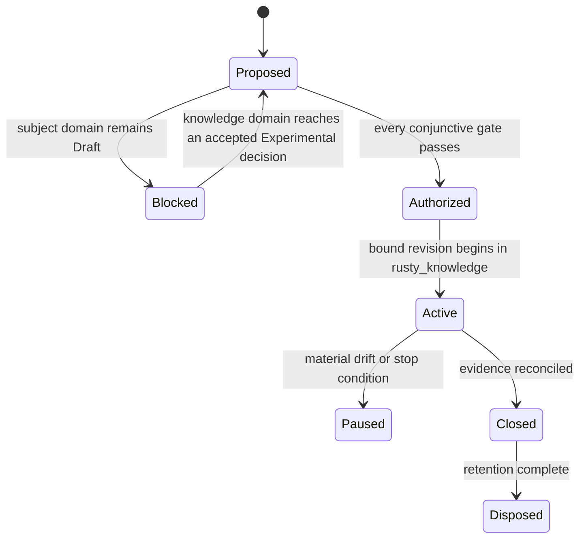

# TRIAL-0003: Rusty Knowledge domain-framework implementation trial

| Field | Value |
|---|---|
| Status | Proposed; authorization blocked |
| Revision | 0 |
| Owner | Rusty Knowledge trial owner role; named person required before authorization |
| Reviewers | Architecture, `knowledge`/`search`/`persistence`/`networking`/`security`/`observability` capability owners, independent standards, security, evidence, and performance reviewers; named people required |
| Created | 2026-08-10 |
| Authorization expires | No authorization exists; any later authorization expires on bound-input drift or its recorded date |
| Implementation authority | None |

The proposal specifies the entry review for the implementation trial [RFC-0003](../../rfc/0003-rusty-knowledge-domain-framework.md) authorized: re-implement the 15 MCP tools and layered-authority/conflict-registry semantics of the existing, working `baileyrd/knowledge-mcp` Python server in Rust, in [`rusty-mill/rusty_knowledge`](https://github.com/Rusty-Mill/rusty_knowledge) (currently empty). It does not authorize a dependency, provider call, native/unsafe code, credential, benchmark run, or the first commit.

## Subject and bound generations

Proposed subject: the `knowledge` domain framework ([README](../../02-capabilities/knowledge/README.md)), architecture model 1.99.0, RFC-0003 (Draft; not yet Accepted at the time of this entry review), ADR-0164 and ADR-0165 (Proposed), a future exact Experimental promotion decision for `knowledge`, a repository standards profile for `rusty_knowledge`, toolchain, platforms/providers, dependencies, and exceptions, plus this trial's own authorization revision.

No exact subject currently satisfies the entry gate. The `knowledge` domain is `Draft domain analysis` per its own [README.md](../../02-capabilities/knowledge/README.md). It has no `promotion-review.md`, `cross-cutting.md`, `ownership.md`, or `source-review.md` — the four files [ADR-0164](../../adr/0164-rusty-knowledge-is-a-domain-framework.md)'s follow-up and RFC-0003's rollout plan both name as prerequisites this entry review cannot substitute for. `rusty_knowledge` itself carries no standards profile at all: it has no commits. This mirrors exactly why [TRIAL-0001](security-batch-trial-proposal.md) and [TRIAL-0002](rustils-trial-proposal.md) remain blocked, and per RFC-0002's rollout rule, RFC-0003's existence and `knowledge-mcp`'s independent maturity cannot substitute for the domain's own promotion status.

**Candidate input evidence generation:** `baileyrd/knowledge-mcp` at its current default-branch commit (single squashed history; `v0.1.0` in `pyproject.toml`), cited per RFC-0002's "clearly qualified input evidence" allowance, not as trial output.

## Questions and hypotheses

| ID | Question and hypothesis | Supporting observation | Refuting observation | Inconclusive condition | Decision informed |
|---|---|---|---|---|---|
| `RK-001` | Does `knowledge-mcp`'s four-layer authority model (Standard → Tool Implementation → Conventions → Process) map cleanly onto a Rust type that makes an unlabeled (layer-less) answer unrepresentable, as [RM-KNOWLEDGE-MODEL-0002](../../02-capabilities/knowledge/model.md) requires? | A Rust response type compiles such that every returned rule carries a non-optional authority-layer field | The layered model requires an escape hatch (an "unknown layer" state) that the Python implementation never needed, indicating semantic loss in translation | The comparison corpus never exercises a rule whose layer is ambiguous in the Python source | `knowledge` capability specification's semantic-model chapter |
| `RK-002` | Does the Python conflict registry's cross-layer contradiction recording survive re-implementation without becoming silent precedence resolution, per [ADR-0165](../../adr/0165-knowledge-layered-authority-carries-over-as-a-requirement.md)? | The Rust implementation's `crosscut.conflicts` reports the same contradictions, with the same disposition, as the Python server for a fixed comparison corpus | The Rust implementation resolves a contradiction internally (e.g., "highest layer wins") without recording it in a queryable registry | The comparison corpus contains no genuine cross-layer contradiction to exercise | `knowledge` capability specification's conflict-registry chapter |
| `RK-003` | Does multi-domain hosting (one server instance, N namespaced domains) hold under a Rust storage/query design without cross-domain leakage, per [RM-KNOWLEDGE-MODEL-0001](../../02-capabilities/knowledge/model.md)? | `meta.list_domains` and scoped lookups return only the queried domain's constructs across at least two loaded domains | A query scoped to one domain returns or is influenced by another domain's rules or constructs | Only one domain (UAF 1.3) has real content; `data_mesh`/`udra` remain stubs, limiting the leakage test's realism | `knowledge` capability specification's domain-isolation chapter |
| `RK-004` | Does hybrid (lexical + vector) retrieval remain the declared default with discoverable degradation, per [RM-KNOWLEDGE-MODEL-0005](../../02-capabilities/knowledge/model.md), once mapped onto a Rust SQLite/vector-search binding? | Search responses carry a retrieval-mode field, and a forced-degraded fixture shows it flip to lexical-only rather than silently substituting | No Rust crate combination is found that exposes FTS5 plus a comparable vector-search extension without bespoke native glue exceeding the trial's dependency limits | No credible Rust vector-search crate is evaluated within the trial's time bound | `knowledge` platform-research and the domain's eventual capability graph edges into `search` |
| `RK-005` | Is the MCP transport (Streamable HTTP/ASGI in Python) representable under Rusty Mill's existing `networking`/`ipc` capabilities, or does it expose a taxonomy gap? | An existing `networking` or `ipc` capability contract, once Draft content matures, covers MCP's request/response and streaming semantics without a new capability | No existing capability's scope statement can plausibly extend to MCP; a new capability or taxonomy entry is needed | `networking` and `ipc` are both themselves Draft, so this question is unanswerable in either direction with current evidence | `knowledge` domain framework's composition list in [taxonomy.md](../../02-capabilities/taxonomy.md) |

## Scope, limits, and nonclaims

**Included only after authorization:** structured reading of `knowledge-mcp`'s source, tests, and `.planning/` docs as candidate qualified input evidence; a written comparison record per `RK-00N` hypothesis; the domain's own promotion-review, cross-cutting, ownership, and source-review documents; no new code in `rusty_knowledge` under this trial's authority until every gate passes.

**Excluded:** any commit to `rusty_knowledge`; any dependency, crate selection, provider call, credential, or benchmark run; any claim that this proposal's existence authorizes implementation; any change to `baileyrd/knowledge-mcp`'s own independent repository.

**Initial limits:** read-only comparison against `knowledge-mcp`'s public repository at a bound commit; no execution of its own test suite under this trial's infrastructure until an authorized verification plan exists; no wall-time limit is set here — that is an authorization input, not guessed in a blocked proposal.

**Nonclaims:** conformance, certification, portability, provider preference, production safety, security strength, native performance, maturity, API stability, crate/repository/package topology, or permission to implement. `knowledge-mcp`'s existing shipped behavior is not thereby endorsed, adopted, or declared Rusty-Mill-conformant by this proposal existing.

## Provider matrix and variance

| Dimension | Windows | Linux | macOS |
|---|---|---|---|
| Storage/query engine | Unevaluated — SQLite embeds cross-platform in Python; Rust binding parity unverified | Unevaluated | Unevaluated |
| Vector-search extension | Unevaluated — `sqlite-vec` used in Python; Rust equivalent unselected | Unevaluated | Unevaluated |
| MCP transport | Unevaluated — Streamable HTTP/ASGI in Python; Rust crate unselected | Unevaluated | Unevaluated |
| Fault, lifecycle, conformance, benchmark support | None yet — no Rust code exists | None yet | None yet |

Every cell is `Unevaluated`, not `Unknown-but-assumed-fine`: this trial has not yet been authorized to evaluate anything, consistent with [platform-research.md](../../02-capabilities/knowledge/platform-research.md)'s own "unverified" framing.

## Evidence plan

| Evidence class | Bound plan |
|---|---|
| Candidate input evidence | `knowledge-mcp`'s `README.md`, `knowledge_mcp/server.py`, its 119+ test functions, and `.planning/MILESTONES.md` at the bound commit — cited, not re-executed, per RFC-0002's qualified-input-evidence allowance |
| Comparison record | one written finding per `RK-00N` hypothesis: supported / refuted / inconclusive, with exact `knowledge-mcp` source citation and exact model/ADR citation |
| Variance | exact platform/backend coverage gaps recorded as such once evaluated; none evaluated yet |
| Provenance | `knowledge-mcp` commit SHA, this AKB's architecture-model version, and this proposal's revision are bound together; any later authorization records the new generations |

No benchmark, dependency-selection, or code-writing activity is planned under this trial's own authority until authorized.

## Repository and operations

No repository activity is authorized under this trial's own authority. `rusty_knowledge` remains empty throughout the Proposed and (if reached) Blocked-to-Authorized states; this trial does not gain commit authority over it until every gate passes. A later authorization, if any, would bind: which `knowledge-mcp` commit is cited, the reviewer(s) performing the comparison, the `rusty_knowledge` standards profile once one exists, and where the comparison record is published (candidate: `docs/02-capabilities/knowledge/knowledge-mcp-comparison.md`, linked from `knowledge`'s `promotion-review.md`).

## Risks and stop conditions

Stop immediately on: any attempt to commit to `rusty_knowledge` before authorization; any attempt to treat RFC-0003's Draft/Accepted status alone as sufficient for the Subject gate; any drift of the cited `knowledge-mcp` commit that changes a hypothesis's supporting/refuting evidence without the comparison record being re-reviewed; any attempt to skip `knowledge`'s own promotion-review gate on the strength of external evidence alone.

The trial owner may pause more conservatively. Only the authorizing authority may approve a revised generation after architecture, capability-owner, and standards review.

## Gate review and decision

| Gate | State | Evidence | Reviewer | Expiry/qualification |
|---|---|---|---|---|
| Subject | Fail | `knowledge` domain is `Draft domain analysis`; [promotion-review.md](../../02-capabilities/knowledge/promotion-review.md) now exists but resolves to "not yet eligible," not an accepted Experimental decision; RFC-0003 itself is Draft | Capability owner and architecture reviewer: unnamed | blocks authorization |
| Learning value | Qualified | `RK-001`–`RK-005` are falsifiable and cite exact `knowledge-mcp` source and exact ADRs/requirements; exact selected subset may narrow on review | Architecture and evidence reviewers: unnamed | review required |
| Bounds | Unknown | scope/nonclaims/exclusions defined; numeric time/review-effort limits unselected | Trial owner and standards reviewer: unnamed | review required |
| Ownership | Unknown | [ownership.md](../../02-capabilities/knowledge/ownership.md) now exists (Review status Unknown); role structure and bounded trial plan defined, but every named-person field is Unassigned | Authorizing maintainer: unnamed | blocks authorization |
| Repository | Fail | `rusty_knowledge` has no commits and no standards profile | Standards reviewer: unnamed | blocks authorization |
| Verification | Qualified | candidate evidence sources identified and cited exactly; no trial-bound verification protocol or re-execution plan exists | Evidence reviewer: unnamed | blocks authorization |
| Cross-cutting | Unknown | [cross-cutting.md](../../02-capabilities/knowledge/cross-cutting.md) now exists (Review status Unknown); dimensions are planned with open blocking findings, not assessed | Quality reviewers: unnamed | blocks authorization |
| Operations | Not applicable | this trial performs no code execution, provider call, or CI activity under its own authority — read/compare only | — | qualifies, does not fail |

**Decision: Not authorized.** Entry is conjunctive; two `Fail` states and every `Unknown` independently block work. RFC-0003's acceptance into `rusty_foundation_akb`, `knowledge-mcp`'s own test coverage, `rusty_knowledge` existing as a named repository, or the existence of `promotion-review.md`/`cross-cutting.md`/`ownership.md` cannot override these states — those documents structure the review; they do not themselves resolve it to Pass.

## Change log

| Revision | Date | Change | Authority impact |
|---|---|---|---|
| 0 | 2026-08-10 | Initial evidence-first entry review for the RFC-0003 implementation trial | None; authorization blocked |
| 0 | 2026-08-10 | `knowledge` domain's promotion-review.md, cross-cutting.md, and ownership.md drafted; Subject/Ownership/Cross-cutting rows updated to cite them | None; still not authorized — see Decision |

## Closeout

Not applicable while unauthorized. A later authorized trial cannot close until each `RK-00N` hypothesis has a supported/refuted/inconclusive disposition with exact citations, the comparison record is published in `docs/02-capabilities/knowledge/`, and a follow-on ADR/RFC/promotion-review proposal or explicit no-change decision is named.

**RM-KNOWLEDGE-TRIAL-0001:** This proposal MUST remain non-authorizing while the `knowledge` domain is Draft, `rusty_knowledge` has no standards profile, or any gate is failed, unknown, expired, contradictory, or lacks named accountable approval.

**RM-KNOWLEDGE-TRIAL-0002:** A later authorization MUST bind one exact proposal revision, architecture model, an accepted Experimental promotion decision for `knowledge`, the exact `knowledge-mcp` commit cited, `rusty_knowledge`'s standards/repository/toolchain generations, hypotheses, limits, evidence plan, named people, expiry, and closeout.

**RM-KNOWLEDGE-TRIAL-0003:** Citing `knowledge-mcp` as candidate input evidence MUST NOT be represented as Rusty-Mill conformance, promotion, or endorsement, and MUST NOT be represented as authorization for `rusty_knowledge`'s first commit until this record's status changes.

**RM-KNOWLEDGE-TRIAL-0004:** Comparison findings MUST remain scoped evidence and MUST NOT independently change architecture, maturity, provider selection, or `knowledge`'s promotion status; only the domain's own promotion-review path can do that.
