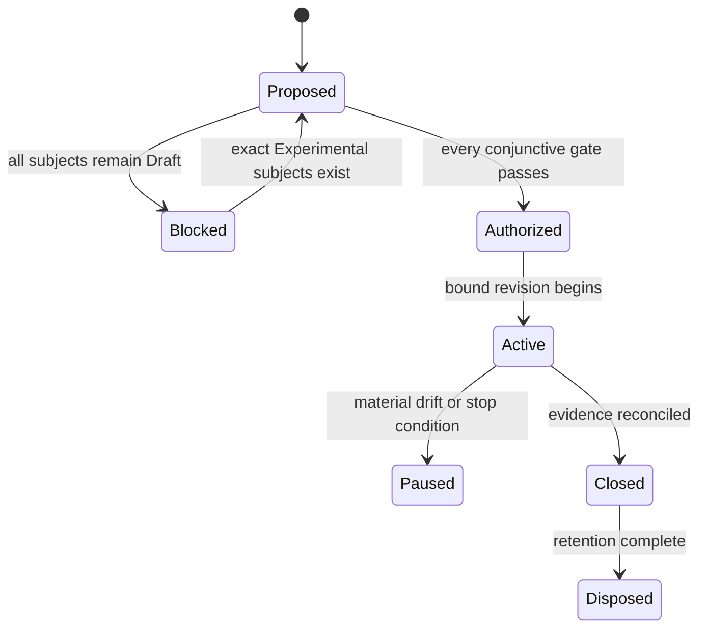

# TRIAL-0001: Security-foundation composed evidence trial

| Field | Value |
|---|---|
| Status | Proposed; authorization blocked |
| Revision | 0 |
| Owner | Security batch trial owner role; named person required before authorization |
| Reviewers | Architecture, seven unit owners, independent security, platform, standards, evidence, privacy/accessibility, performance, and operations roles; named people required |
| Created | 2026-08-08 |
| Authorization expires | No authorization exists; any later authorization expires on bound-input drift or its recorded date |
| Implementation authority | None |

The proposal specifies how a future disposable trial could resolve cross-unit uncertainty. It does not authorize a repository, dependency, provider call, native/unsafe code, credential, key, certificate, policy, platform mutation, benchmark run, or implementation task.

## Subject and bound generations

Proposed subject: one composed tuple drawn from the seven [security promotion units](../../02-capabilities/security/promotion-units.md), the [batch integration review](../../04-ecosystem/consistency-readiness/security-batch-integration-review.md), [batch conformance](../../04-ecosystem/consistency-readiness/security-batch-conformance.md), [batch benchmarks](../../04-ecosystem/consistency-readiness/security-batch-benchmarks.md), architecture model 1.99.0, the future exact Experimental decisions, repository standards profile, toolchain, platforms/providers, dependencies, exceptions, and trial authorization revision.

No exact subject currently satisfies the entry gate because all seven units are Draft and no Experimental promotion decision, provider selection, named staffing, repository profile instance, or trial authorization exists. The trial MUST remain blocked until the selected subset and every composition dependency are promotion-eligible for the claimed questions; one unit cannot borrow another unit’s status.

## Questions and hypotheses

| ID | Question and hypothesis | Supporting observation | Refuting observation | Inconclusive condition | Decision informed |
|---|---|---|---|---|---|
| `STH-001` | Can one immutable compatible tuple be resolved before side effects? | every selected policy/provider/generation mismatch is detected before activation or mutation | any silent default/substitution or stale plan reaches a side effect | provider cannot expose discovery/preparation boundary | plan and provider contracts |
| `STH-002` | Do typed evidence and authority boundaries survive composition? | identity, key/cert/attestation/trust evidence never grants unrelated operation authority | any evidence value authorizes an unselected resource/action | required native observation is unavailable | authority and consumer contracts |
| `STH-003` | Can opaque secret/key use avoid reusable material disclosure? | selected mediated operations complete with canaries absent from memory/diagnostics outside declared boundary | reusable material crosses an undeclared boundary or handle substitution succeeds | provider evidence cannot distinguish internal exposure | secret/key/provider profiles |
| `STH-004` | Are validation and issuance lifecycle feedback compatible without semantic cycles? | issuance/result validation/installation/activation/renewal keep independent generations and authority | validation authorizes issuance or issuance implies trust/activation | selected protocol/provider hides required milestone | PKI composition and graph edges |
| `STH-005` | Does restricted release prevent pre-verification execution? | required authority and controls are verified before any child-controlled oracle fires | child-controlled code executes with missing/unverified/degraded controls | platform cannot provide a trustworthy execution oracle | restricted provider eligibility |
| `STH-006` | Are cancellation, provider loss, rotation, and revocation truthful? | accepted/indeterminate/committed states, aliases, residuals, and reconciliation remain observable | timeout fabricates rollback, loses ownership, reuses stale state, or hides surviving effect | destructive lifecycle cannot be isolated or observed | lifecycle and recovery contracts |
| `STH-007` | Can guarantee-equivalent compositions meet future performance objectives? | unit and batch conformance pass and staged measurements are reproducible against equivalent native baselines | required semantics cause unacceptable measured cost or baseline equivalence fails | no accepted product objective or representative environment exists | later budgets/provider choices; no budget is set here |

## Scope, limits, and nonclaims

Included only after authorization: generated synthetic principals/claims/policies, disposable authority-bearing resources, ephemeral random requests, generated secret/key/certificate material, private disposable CA/trust/status services, isolated restricted test workloads, loopback/isolated network fixtures, unit and batch negative cases, fault injection, sanitized evidence, and staged benchmark harnesses.

Excluded: production identities/accounts/policies/stores/keys/certificates/CAs/HSM partitions/device management/DNS/services/trust roots, public issuance, enterprise trust or host-security mutation, real user data, Internet scanning, external load, persistent authority serialization, release packaging, stable public API, product integration, migration, operational deployment, and performance optimization beyond measurement scaffolding.

Initial limits: one explicit composition per authorized revision; one provider path per selected platform; disposable VM/container/sandbox per attempt; no network route beyond declared fixtures and dependency retrieval policy; least privileges; bounded objects, processes, bytes, concurrency, retries, clocks, and wall time; no long-lived secrets; no material in logs or retained fingerprints. Exact numeric limits are authorization inputs, not guessed here.

Nonclaims: security strength, certification, FIPS or platform compliance, portability, provider preference/equivalence, production safety, revocation completeness, physical erasure, native performance, availability, release support, maturity, API stability, crate/repository/package topology, or permission to implement.

## Provider matrix and variance

| Dimension | Windows | Linux | macOS | Gate |
|---|---|---|---|---|
| Exact OS/SDK/kernel and deployment | Unselected | Unselected | Unselected | blocking |
| Authority and restricted-execution mechanisms | Unselected token/Authz/isolation composition | Unselected credentials/capabilities/namespaces/seccomp/LSM composition | Unselected sandbox/entitlement/security-scoped/helper composition | blocking |
| Random, secret, and crypto providers | Unselected exact provider/module/store/key boundary | Unselected exact kernel/library/store/key boundary | Unselected exact Security/Keychain/key boundary | blocking |
| PKI validation and issuance paths | Unselected trust/enrollment/provider/profile | Unselected library/store/protocol/CA/profile | Unselected trust/managed enrollment/provider/profile | blocking |
| Sync/async, interaction, cancellation | exact operations and waits unselected | exact operations and waits unselected | exact operations and waits unselected | blocking |
| Fault, lifecycle, conformance, benchmark support | fixtures and safe injection unproven | fixtures and safe injection unproven | fixtures and safe injection unproven | blocking |

Unsupported or unobservable combinations are recorded as such; they are not normalized, simulated as native evidence, or silently dropped. The first authorization may select fewer platforms/units only if its claims and hypotheses are narrowed accordingly and no portability claim is made.

## Evidence plan

| Evidence class | Bound plan |
|---|---|
| Semantics | exact unit assertion IDs plus `SEC-BATCH-CONF-001`–`015`, case revisions, inputs/generations, stage oracles, attempt identities, raw sanitized results |
| Variance | exact platform/provider/mechanism/feature discovery, unsupported/degraded states, differential results, deployment assumptions, aliases/bypasses |
| Performance | stable `rm.benchmark.security-batch.*@1` scenarios, unit scenarios, equivalent native baselines, workloads/environments, samples/uncertainty, stage results, raw artifacts |
| Safety | threat hypotheses, explicit authority, unsafe/FFI boundaries if later approved, canaries, negative/adversarial cases, isolation, network/data limits, stop evidence |
| Inclusive quality | accessible interaction/explanation/progress/cancellation/recovery, locale/bidi/native identifier handling, privacy/disclosure review, findings/nonclaims |
| Operations | sanitized logs/metrics/traces, loss/redaction, provider failure, cleanup, restore/update, revocation, reconciliation, residual inventory |
| Provenance | source/architecture/profile/lock/toolchain/runner/configuration revisions, provider artifacts, attestations where applicable, signed evidence manifest |

Every attempt records planned, started, skipped, rejected, failed, canceled, timed-out, indeterminate, and completed states. Evidence is append-only within the trial record; invalid attempts remain with rationale. Raw sensitive material is never retained merely to prove testing.

## Repository and operations

No repository is authorized or selected. A later authorization binds a repository generation and approved [repository profile](../software-development/repository-profile.md), protected review, CODEOWNERS/branch rules, pinned toolchain/lock state, minimal preapproved dependencies, isolated CI runners, artifact access/retention, secret injection without repository storage, no fork exposure, network allowlist, provenance, emergency stop authority, and disposal workflow.

Trial code and artifacts remain isolated from production crates/packages/releases. Promotion, publication, installation, or dependency by a product repository is prohibited. Material drift pauses work under [change control](change-control.md); the owner inventories state before re-review.

## Risks and stop conditions

Stop immediately on authority expansion or confusion; uncontrolled ambient privilege; unrestricted child execution; secret/key/bearer/random/certificate material leakage; provider/profile downgrade; unapproved algorithm/control/trust/issuance; production or host trust/security mutation; external network escape; cross-tenant/provider handle substitution; replay/audience/depth bypass; ambiguous move/key/secret/certificate ownership; CA ledger/serial rollback or clone; fabricated cancellation/revocation/rollback; unbounded resource use; evidence tampering/loss; dependency/provenance drift; or inability to account for every generated authority, process, resource, secret, key, certificate, service, cache, effect, and artifact.

The trial owner may pause more conservatively. Only the authorizing authority may approve a revised generation after security, architecture, standards, and evidence review; emergency containment cannot broaden scope or erase evidence.

## Gate review and decision

| Gate | State | Evidence | Reviewer | Expiry/qualification |
|---|---|---|---|---|
| Subject | Fail | seven units and batch review remain Draft; no Experimental decision | Capability owners and architecture reviewer: unnamed | blocks authorization |
| Learning value | Unknown | `STH-001`–`007` are falsifiable, but exact selected subset/providers may change whether implementation is necessary | Architecture and evidence reviewers: unnamed | review required |
| Bounds | Unknown | scope/nonclaims/stop categories defined; numeric and platform/provider limits unselected | Trial owner and security reviewer: unnamed | review required |
| Ownership | Unknown | accountable roles defined; people, independence, availability, and approvals absent | Authorizing maintainer: unnamed | blocks authorization |
| Repository | Unknown | governance requirements defined; repository/profile/toolchain/dependencies/exceptions absent | Standards reviewer: unnamed | blocks authorization |
| Verification | Unknown | unit/batch assertion and scenario identities defined; cases, harnesses, environments, artifact locations absent | Evidence reviewer: unnamed | blocks authorization |
| Cross-cutting | Unknown | required review dimensions defined; named methods/reviewers for selected composition absent | Quality reviewers: unnamed | blocks authorization |
| Operations | Unknown | runner/secrets/artifact/network/cleanup requirements defined; exact controls and approvals absent | Operations/security reviewers: unnamed | blocks authorization |

**Decision: Not authorized.** Entry is conjunctive; one `Fail` and every `Unknown` independently block work. Scores, dossier counts, batch compatibility, repository existence, or informal approval cannot override these states.

## Change log

| Revision | Date | Change | Authority impact |
|---|---|---|---|
| 0 | 2026-08-08 | Initial evidence-first proposal | None; authorization blocked |

## Closeout

A later authorized trial cannot close until every hypothesis has supported/refuted/inconclusive disposition; every attempt and deviation is reconciled; every generated authority/resource/process/channel/secret/key/request/certificate/trust/status/service/cache/effect and provider/host mutation is inventoried; retained evidence is sanitized, provenance-bound, reviewed, and assigned retention; disposable assets are verifiably removed; residuals and limitations are recorded; access is revoked; and a follow-on ADR/RFC/contract/promotion proposal or explicit no-change decision is named.

**RM-SECURITY-TRIAL-0001:** This proposal MUST remain non-authorizing while any subject is Draft or any gate is failed, unknown, expired, contradictory, or lacks named accountable approval.

**RM-SECURITY-TRIAL-0002:** A later authorization MUST bind one exact proposal revision, architecture model, Experimental subject tuple, standards/repository/toolchain/provider/dependency/exception generations, hypotheses, limits, evidence plan, people, expiry, and closeout.

**RM-SECURITY-TRIAL-0003:** Trial execution MUST NOT begin, create a repository, add dependencies, call providers, generate security material, reserve external resources, or mutate a platform until the authorizing record changes every required gate to an evidenced approved state.

**RM-SECURITY-TRIAL-0004:** Success, failure, and inconclusive results MUST remain scoped evidence and MUST NOT independently change architecture, maturity, provider selection, compatibility, support, packaging, or release status.
