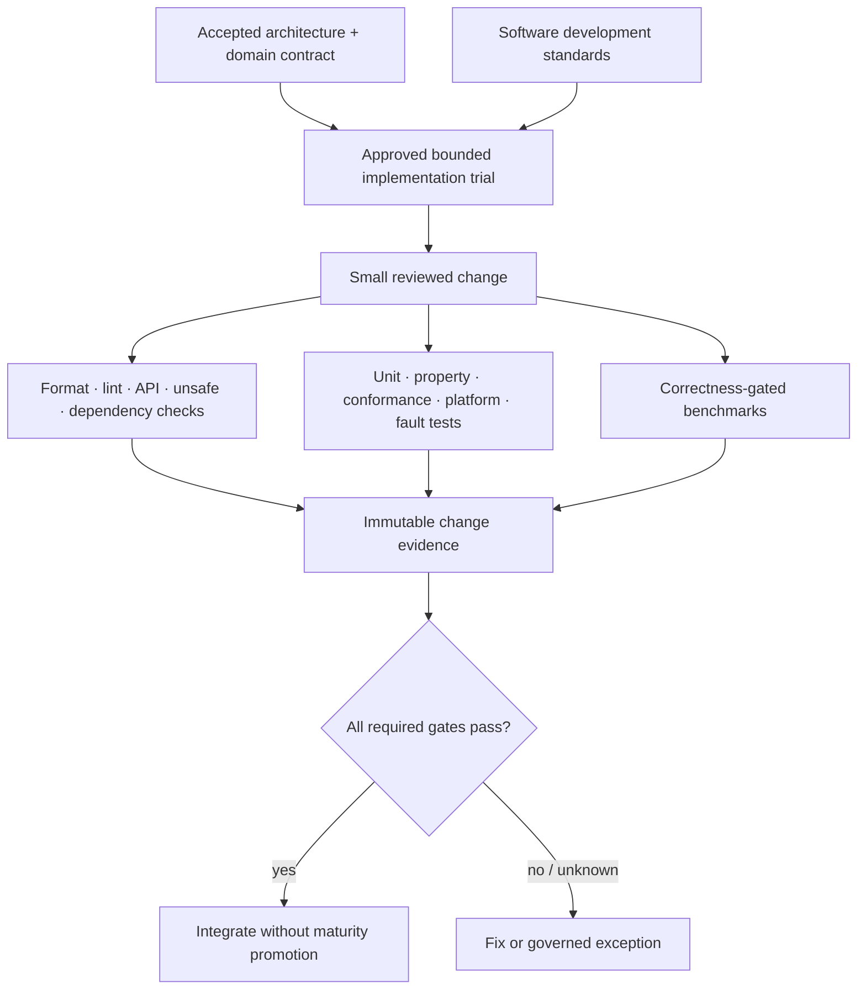

# Rusty Mill software development standards

**Status:** Accepted foundation governance  
**Authority:** [Authoritative architecture model](../../01-architecture/architecture-model.md)

These standards govern any Rusty Mill implementation trial, library, tool, test harness, provider, generated artifact, or release automation. They operationalize the architecture without selecting capability APIs or authorizing implementation. A domain must independently pass its promotion gates before code can establish even Experimental precedent.

## Governing conclusions

- Architecture and behavioral contracts precede public Rust API shape.
- Safe Rust is the default; unsafe and FFI are isolated proof obligations with explicit review and budgets.
- Async is used for genuine concurrency and nonblocking waits; sync completeness remains explicit and cannot create hidden runtimes.
- Correctness, security, accessibility, internationalization, operability, and evidence are definition-of-done concerns, not later hardening phases.
- Native performance claims require semantically equivalent baselines and correctness gates.
- Dependencies are design decisions with ownership, provenance, license, security, maintenance, and exit analysis.
- Generated checks support review but do not replace accountable human judgment.
- Exceptions are scoped, owned, expiring, and visible; suppression without rationale is not an exception process.

## Standards documents

- [Development design philosophy and adopted influences](design-philosophy.md)
- [Scope, applicability, and rule governance](scope-governance.md)
- [Rust language, workspace, and code structure](rust-language.md)
- [Public APIs, types, compatibility, and errors](api-errors.md)
- [Async, sync, concurrency, cancellation, and resources](async-concurrency.md)
- [Unsafe Rust, FFI, native handles, and platform backends](unsafe-ffi.md)
- [Testing, conformance, fuzzing, and failure evidence](verification.md)
- [Performance and resource engineering](performance.md)
- [Security, privacy, accessibility, i18n, and observability](secure-inclusive.md)
- [Dependencies, build inputs, and supply chain](dependencies-supply-chain.md)
- [Change design, review, CI, and merge gates](review-ci.md)
- [Documentation, compatibility, release, and maintenance](documentation-release.md)
- [Exceptions, debt, incident feedback, and standards evolution](exceptions-evolution.md)
- [Repository standards profile contract](repository-profile.md)
- [Standards compliance evidence](compliance-evidence.md)

## Applicability gate

**RM-DEV-GOV-0001:** No implementation trial MAY begin until its exact domain/capability generation is authorized for Experimental work and declares which standards, toolchain policy, platform matrix, evidence plan, and exceptions apply.

**RM-DEV-GOV-0002:** These standards MUST NOT be used to infer an API, crate boundary, provider choice, or implementation authority absent from the architecture and domain contract.

**RM-DEV-GOV-0003:** Every repository MUST publish a machine-checkable standards profile identifying inherited rules, stricter local rules, approved deviations, supported toolchains/targets, and required evidence before accepting implementation code.
