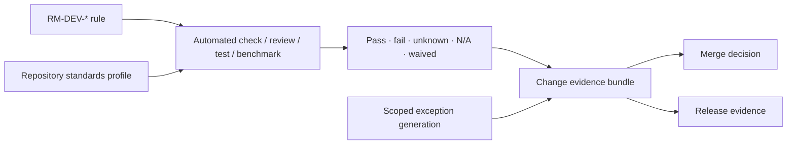

# Standards compliance evidence

Compliance is evidence about an exact change/repository generation, not a permanent repository label.

## Evidence methods

| Method | Suitable proof | Limitation |
|---|---|---|
| Static/tool check | format, lint, metadata, dependency, policy projections | configuration correctness and semantic intent still need review |
| Architecture/API review | boundaries, authority, compatibility, unsafe invariants | judgment must bind scope/reviewer/evidence |
| Test/conformance result | executable behavior under exact environment | cannot generalize beyond assertion/provider matrix |
| Benchmark result | quantitative scenario under comparable semantics | does not prove correctness without gates |
| Artifact/provenance inspection | source/build/release identity and inputs | signature/provenance does not prove behavior |
| Manual specialist assessment | security, privacy, accessibility, i18n, operations | must use recorded method/findings and expiry |

**RM-DEV-EVIDENCE-0001:** Every applicable `RM-DEV-*` rule MUST map through the repository profile to an automated check, explicit review method, executable evidence, or justified non-applicability before a trial/release gate can pass.

**RM-DEV-EVIDENCE-0002:** Results use `pass`, `fail`, `unknown`, `not-applicable`, or `waived`. Unknown and expired evidence block the affected gate; not-applicable and waived require reviewed records.

**RM-DEV-EVIDENCE-0003:** A change bundle binds commit/tree, repository profile, standards version, tool/configuration, reviewers, checks, tests, benchmarks, artifacts, exceptions, findings, attempts, and decision.

**RM-DEV-EVIDENCE-0004:** Evidence reuse requires unchanged relevant source, dependencies, toolchain, configuration, platform/provider, standards, assertions, and risk frontier. Otherwise the evidence is stale or must be qualified.

**RM-DEV-EVIDENCE-0005:** The first implementation RFC MUST propose the standards-profile serialization and validation/enforcement tooling based on at least two materially different repository trials; the AKB does not prematurely select it.

## Entry-gate checklist

Before an implementation trial:

1. Exact domain/capability generation is Experimental-authorized.
2. Trial purpose, bounds, nonclaims, owner, disposal/promotion path, and platform matrix are approved.
3. Repository profile is valid and links these standards.
4. Public/unsafe/dependency/toolchain changes have designated reviewers.
5. Assertions, executable cases, benchmark scenarios, and evidence storage are identified.
6. Security/privacy/accessibility/i18n/observability/operations plans and findings are bound.
7. CI trust, secrets, runners, artifact provenance, and emergency authority are defined.
8. Active exceptions are valid and visible.

Failure or unknown in any required item keeps implementation unauthorized.
