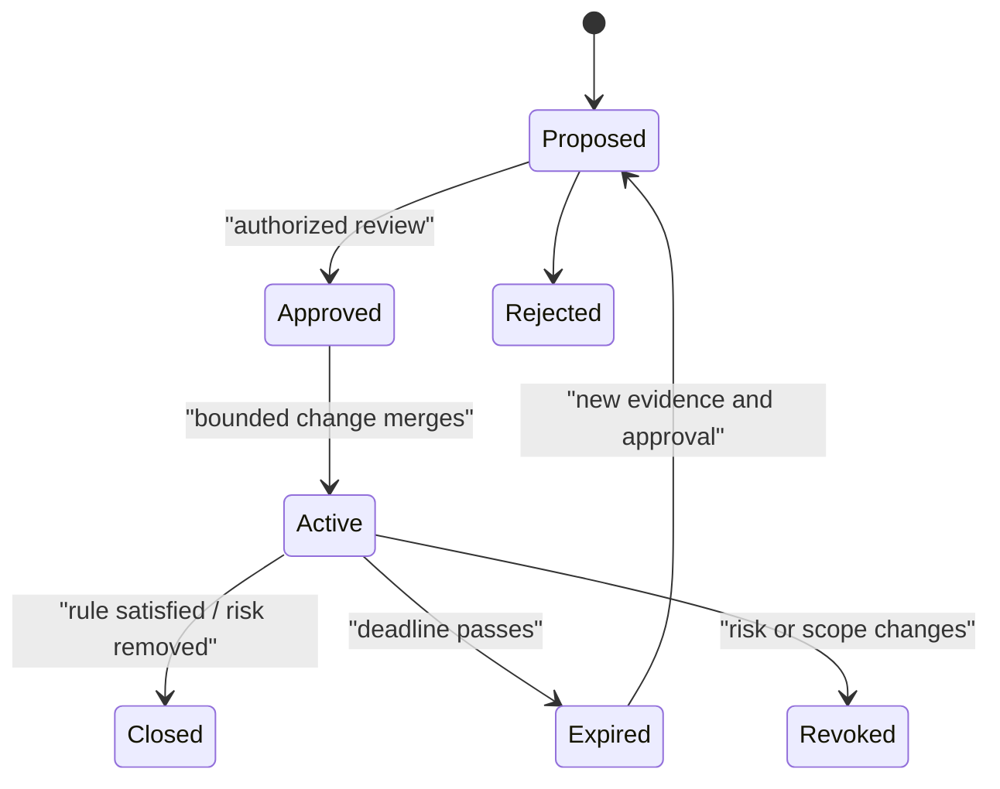

# Exceptions, debt, incident feedback, and standards evolution

**RM-DEV-EXC-0001:** An exception identifies rule IDs, exact repository/component/change/target scope, rationale, alternatives, risk, compensating controls/evidence, owner, approvers, issue, start, expiry/trigger, closure condition, and affected release claims.

**RM-DEV-EXC-0002:** Exceptions are narrow and time-bounded. Copying a suppression, inherited configuration, precedent, schedule pressure, or “temporary” comment does not authorize deviation.

**RM-DEV-EXC-0003:** Exceptions cannot waive law/license, undeclared safety invariants, secret handling, release identity/provenance, or truthful evidence. Architecture/security authorities may define additional non-waivable gates.

**RM-DEV-EXC-0004:** Expired/revoked exceptions fail the affected gate. Renewal is a new reviewed decision using current evidence; prior approval is not automatic.

**RM-DEV-DEBT-0001:** Technical debt records affected requirement/invariant, consequence, owner, priority, triggers, evidence, containment, and closure. Debt cannot silently redefine the public contract.

**RM-DEV-INCIDENT-0001:** Incidents, vulnerabilities, conformance failures, performance regressions, accessibility defects, and near misses feed standards/architecture review with root cause, detection gap, systemic action, and verification.

**RM-DEV-EVOLVE-0001:** Standards changes preserve rule identity/history, explain evidence and alternatives, classify compatibility/tooling impact, provide migration, and update enforcement projections atomically.

**RM-DEV-EVOLVE-0002:** A rule may be retired only when replacement/scope history remains discoverable and repositories can prove no active dependency on its former guarantee.
