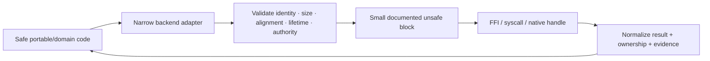

# Unsafe Rust, FFI, native handles, and platform backends

Safe Rust is the default. Unsafe code is an explicit proof obligation, not a performance adjective. Rust 2024's [`unsafe_op_in_unsafe_fn`](https://doc.rust-lang.org/edition-guide/rust-2024/unsafe-op-in-unsafe-fn.html) separation is adopted: unsafe functions declare caller obligations; individual unsafe operations remain in explicit blocks.

**RM-DEV-UNSAFE-0001:** Crates deny unsafe code by default. A crate permitting unsafe MUST declare its unsafe surface/budget, owner, threat model, invariants, reviewers, test/fuzz/model evidence, and audit cadence.

**RM-DEV-UNSAFE-0002:** Every unsafe block has an adjacent `SAFETY:` explanation covering all preconditions and why they hold at that exact point. Comments that merely restate the operation are insufficient.

**RM-DEV-UNSAFE-0003:** `unsafe_op_in_unsafe_fn` is denied. Unsafe functions document caller obligations under a `# Safety` section and keep operations in the smallest reviewable explicit blocks.

**RM-DEV-UNSAFE-0004:** Unsafe abstractions MUST prevent safe callers from violating aliasing, lifetime, initialization, alignment, provenance, thread, unwind, ownership, or native-contract invariants.

**RM-DEV-FFI-0001:** FFI declarations bind exact ABI, target/provider versions, type/layout assumptions, ownership transfer, nullability, encoding, error convention, callbacks, threading, reentrancy, and unload/lifetime rules.

**RM-DEV-FFI-0002:** No panic or foreign exception crosses an FFI boundary. Callback trampolines contain panic/failure according to explicit policy and keep backing state alive until terminal native acknowledgement.

**RM-DEV-FFI-0003:** Native handles are owned/borrowed typed resources with generation and duplication/inheritance policy. Raw integer/pointer exposure is confined to reviewed adapters.

**RM-DEV-FFI-0004:** Input lengths, counts, offsets, encodings, terminators, structures, and output initialization are validated with overflow-safe arithmetic before unsafe/native access.

**RM-DEV-UNSAFE-0005:** Performance-motivated unsafe requires benchmark evidence against the safe design, equivalent semantics, measured material benefit, and a maintained safe fallback or documented reason none is possible.
